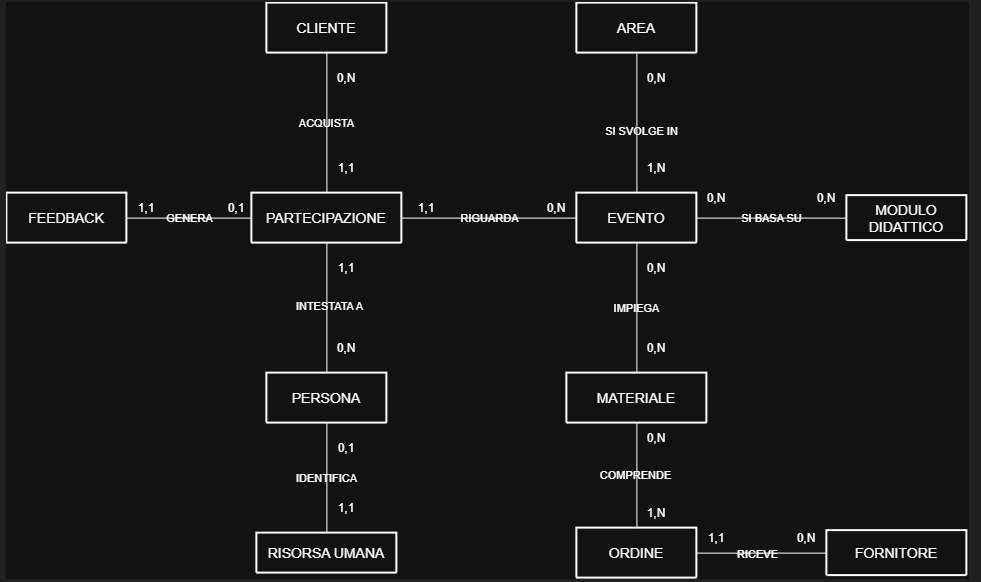
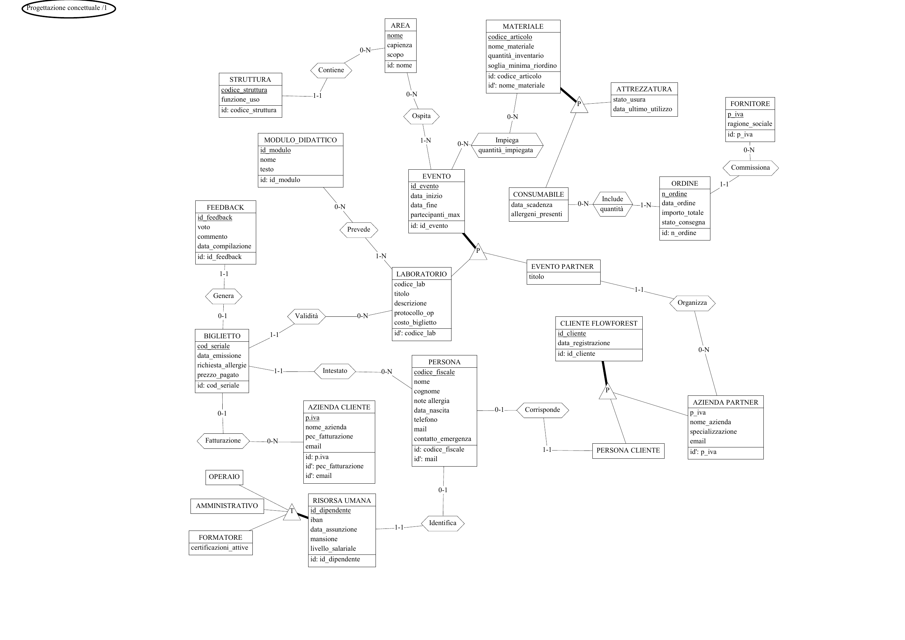
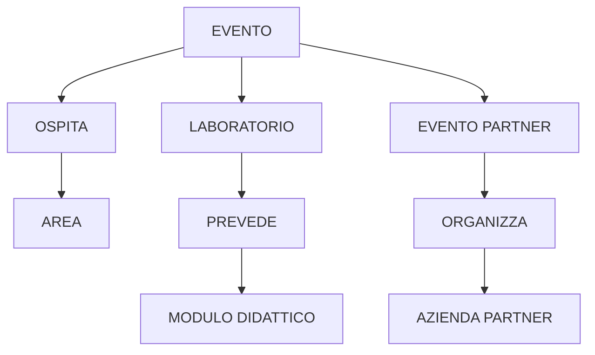
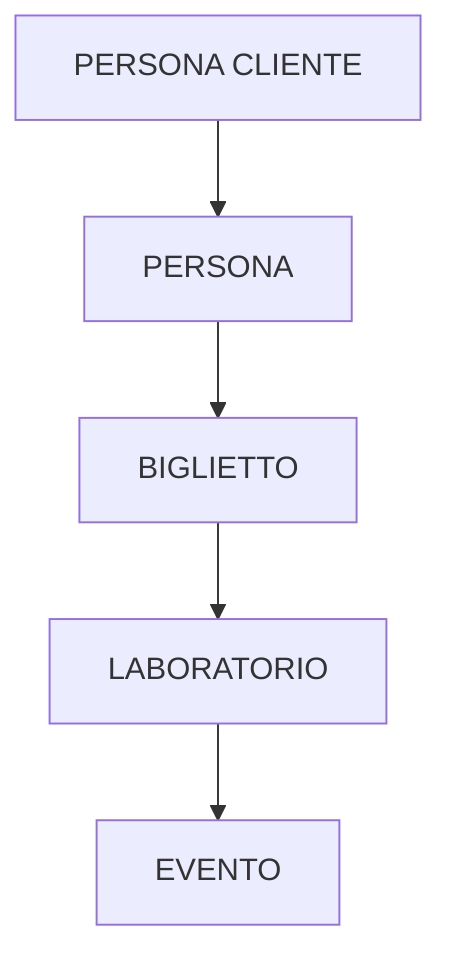
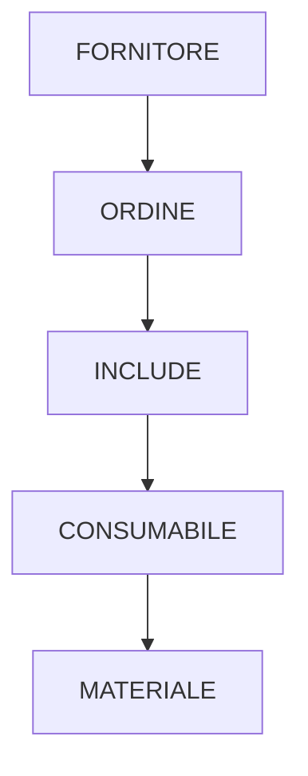
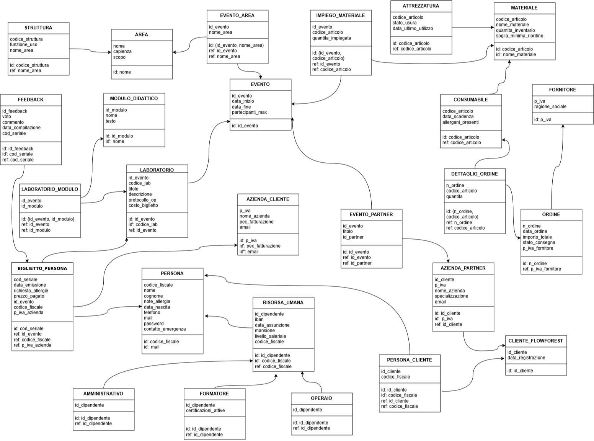
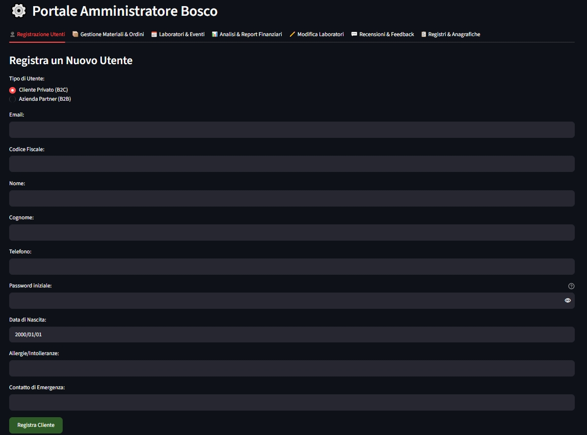
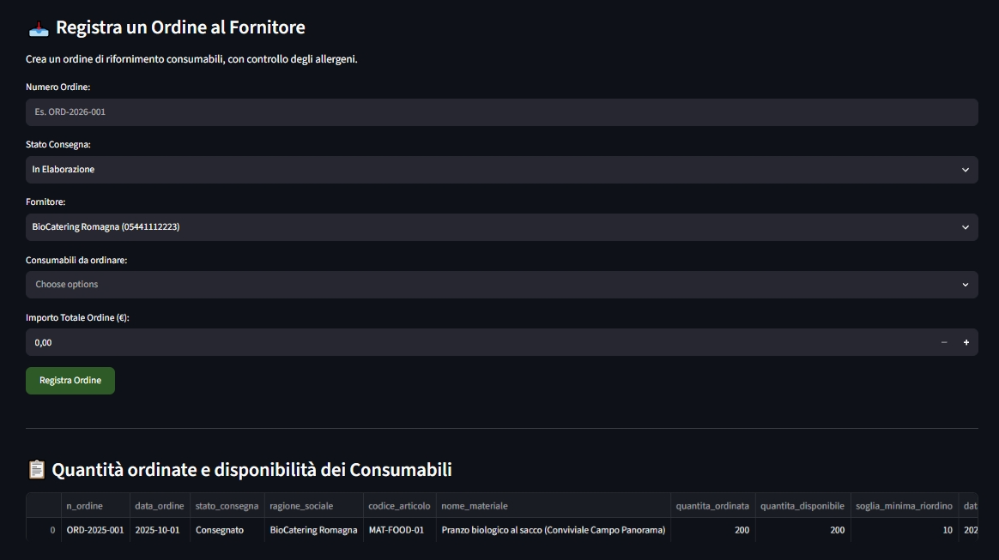
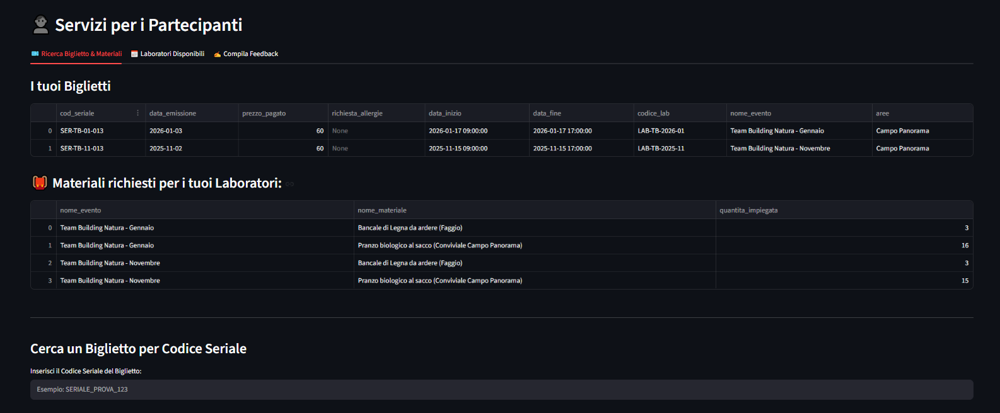
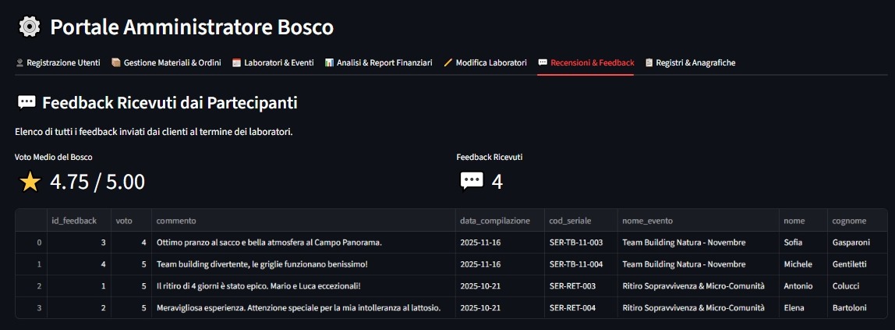

# Relazione Finale di Progetto: Basi di Dati
**Progetto:** Database per FlowForest

**Versione canonica integrata:** il presente documento unifica l'analisi, la progettazione e l'implementazione del progetto in un'unica numerazione progressiva.

## Indice

1. Analisi dei requisiti
   - 1.1 Intervista
   - 1.2 Rilevamento delle ambiguità e correzioni proposte
   - 1.3 Specifiche ristrutturate ed estrazione dei concetti principali
   - 1.4 Analisi delle operazioni e dei profili applicativi
     - 1.4.1 Operazioni per i partecipanti
     - 1.4.2 Operazioni per i gestori
2. Progettazione concettuale
   - 2.1 Schema scheletro
   - 2.2 Raffinamenti proposti
   - 2.3 Schema concettuale finale
     - 2.3.1 Entità e identificatori
     - 2.3.2 Gerarchie
     - 2.3.3 Associazioni e cardinalità
     - 2.3.4 Diagramma E-R finale
3. Progettazione logica
   - 3.1 Stima del volume dei dati
   - 3.2 Operazioni principali e stima della frequenza
   - 3.3 Schemi di navigazione e tavole degli accessi
   - 3.4 Analisi delle ridondanze
   - 3.5 Raffinamento dello schema
   - 3.6 Traduzione sistematica di entità e associazioni in relazioni
   - 3.7 Schema relazionale finale
4. Progettazione fisica
   - 4.1 Indici generati da chiavi e vincoli di unicità
   - 4.2 Indici secondari per navigazione, filtri e ordinamenti
5. Implementazione nel DBMS
   - 5.1 Definizione dello schema fisico (DDL)
   - 5.2 Operazioni per i partecipanti
   - 5.3 Operazioni per i gestori del bosco
6. Progettazione dell'applicazione
   - 6.1 Architettura e scelte tecnologiche
   - 6.2 Autenticazione e profili di accesso
   - 6.3 Interfaccia utente e funzionalità
   - 6.4 Copertura delle operazioni e limiti del prototipo
   - 6.5 Screenshot dell'interfaccia

# 1. Analisi dei requisiti

## 1.1 Intervista

Il seguente testo costituisce la rielaborazione strutturata delle informazioni raccolte durante l'intervista con i referenti di FlowForest.

Si vuole realizzare una base di dati per **FlowForest**, un'azienda che gestisce un bosco e lo utilizza per organizzare attività formative incentrate sullo sviluppo dell'intelligenza pratica e per concedere i propri spazi ad aziende partner che organizzano eventi autonomi.

Il bosco è suddiviso in aree, ciascuna caratterizzata da nome, capienza e scopo. Un evento può utilizzare una o più aree e una stessa area può ospitare eventi differenti nel tempo. Ogni area può inoltre contenere strutture fisiche, come capanne o pergolati, delle quali si registrano un codice identificativo e la funzione d'uso.

Le attività organizzate e vendute direttamente da FlowForest sono chiamate **Laboratori**. Ogni laboratorio possiede un titolo, una descrizione, un protocollo operativo e un costo del biglietto; è inoltre composto da uno o più moduli didattici, dei quali vengono conservati nome e testo. Per partecipare a un laboratorio viene emesso un biglietto nominale, sul quale sono registrati il codice seriale, la data di emissione, il prezzo pagato e le eventuali richieste relative alle allergie. Il biglietto è sempre intestato alla persona che partecipa e può essere fatturato a un'azienda cliente.

Al termine del laboratorio, il titolare del biglietto può compilare un feedback composto da voto, commento e data di compilazione. Ogni biglietto può generare al massimo un feedback, in modo che la valutazione rimanga riferita a una specifica partecipazione.

Gli eventi organizzati da aziende esterne sono denominati **Eventi Partner**. Di ogni azienda partner vengono registrati partita IVA, nome, specializzazione ed email. FlowForest conserva le informazioni organizzative dell'evento e dell'azienda che lo organizza, ma non gestisce i biglietti dei partecipanti né una percentuale sui ricavi dell'evento partner.

FlowForest gestisce anche l'inventario dei materiali necessari alle attività. Di ogni materiale vengono registrati codice, nome, quantità disponibile e soglia minima di riordino. I materiali si dividono in attrezzature riutilizzabili, caratterizzate da stato di usura e data dell'ultimo utilizzo, e consumabili, per i quali si conservano data di scadenza ed eventuali allergeni. Per ogni evento vengono indicati i materiali impiegati e le relative quantità.

I consumabili vengono acquistati mediante ordini indirizzati a fornitori esterni. Ogni ordine registra data, importo totale e stato di consegna e comprende uno o più consumabili, indicando per ciascuno la quantità ordinata.

Il personale viene rappresentato tramite la **Risorsa Umana**, della quale vengono registrati identificativo del dipendente, IBAN, data di assunzione, mansione e livello salariale. Ogni risorsa ricopre almeno uno dei ruoli di formatore, operaio o amministrativo e può ricoprirne più di uno contemporaneamente. Per i formatori vengono inoltre conservate le certificazioni attive. Il sistema non registra l'assegnazione del personale ai singoli laboratori.

Le persone registrate possono accedere all'applicazione mediante email e password. L'interfaccia distingue i clienti dallo staff e rende disponibili funzionalità differenti in base al profilo autenticato. La password costituisce un dato tecnico dell'applicazione e non un concetto autonomo del dominio.

## 1.2 Rilevamento delle ambiguità e correzioni proposte

A seguito della lettura delle specifiche iniziali, la terminologia è stata uniformata e sono state esplicitate le decisioni necessarie per evitare interpretazioni differenti.

| Termine o espressione iniziale | Termine o decisione adottata | Chiarimento |
| :--- | :--- | :--- |
| Utente / partecipante | **Persona** | Identifica il soggetto fisico che partecipa a un laboratorio o lavora per FlowForest. È distinto dal soggetto che sostiene la spesa. |
| Cliente privato | **Persona Cliente** | È una persona fisica registrata come cliente di FlowForest. |
| Azienda che acquista biglietti | **Azienda Cliente** | Rappresenta il soggetto al quale possono essere fatturati i biglietti acquistati per i propri dipendenti. |
| Formatore esterno / partner | **Azienda Partner** | Rappresenta l'azienda esterna che organizza un proprio evento utilizzando gli spazi di FlowForest. Non vengono gestiti biglietti o fee dell'evento partner. |
| Laboratorio / evento | **Evento**, **Laboratorio**, **Evento Partner** | `EVENTO` raccoglie le caratteristiche comuni; `LABORATORIO` ed `EVENTO_PARTNER` rappresentano le due tipologie alternative. |
| Area dell'evento | Una o più **Aree** | Un evento può utilizzare più aree e la stessa area può ospitare molti eventi nel tempo. |
| Gruppo | Concetto derivato | Il gruppo coincide con l'insieme dei titolari dei biglietti emessi per un laboratorio e non possiede attributi o un ciclo di vita autonomo. |
| Clienti dei partner | Fuori dal perimetro | I partecipanti agli eventi partner non vengono registrati e non ricevono biglietti tramite il sistema FlowForest. |
| Materiale | **Attrezzatura** / **Consumabile** | La specializzazione permette di gestire usura e riutilizzo delle attrezzature, nonché scadenze e allergeni dei consumabili. |
| Quantità necessaria | Attributo di **Impiega** | La quantità utilizzata dipende dalla coppia evento-materiale e viene quindi registrata sull'associazione. |
| Contenuto dell'ordine | Associazione **Include** | Per ogni coppia ordine-consumabile viene registrata la quantità ordinata. |
| Personale / ruolo | **Risorsa Umana** e relativi sottotipi | Mansione e livello salariale appartengono alla Risorsa Umana; Formatore, Operaio e Amministrativo rappresentano ruoli anche contemporanei. |
| Feedback per evento | **Feedback per biglietto** | La valutazione è riferita a una specifica partecipazione; ogni biglietto può produrre al massimo un feedback. |
| Diritto all'invito | Informazione derivata | Il diritto è verificato contando le partecipazioni concluse e non viene memorizzato, evitando una ridondanza. |

## 1.3 Specifiche ristrutturate ed estrazione dei concetti principali

FlowForest utilizza il bosco per realizzare due tipologie di evento: i **Laboratori**, organizzati e venduti direttamente dall'azienda, e gli **Eventi Partner**, organizzati da aziende esterne. Ogni evento possiede un identificativo, una data di inizio, una data di fine e un numero massimo di partecipanti e utilizza una o più aree del bosco.

I Laboratori comprendono titolo, descrizione, protocollo operativo e costo del biglietto e prevedono uno o più Moduli Didattici. Gli Eventi Partner conservano invece il titolo e il collegamento all'Azienda Partner che li organizza. Il sistema non gestisce i biglietti dei partecipanti agli Eventi Partner e non registra fee o ricavi derivanti da tali eventi.

La partecipazione a un Laboratorio viene rappresentata da un **Biglietto** nominale, intestato a una Persona e facoltativamente fatturato a un'Azienda Cliente. Il biglietto conserva codice seriale, data di emissione, richieste relative alle allergie e prezzo effettivamente pagato. A ogni biglietto può essere associato al massimo un Feedback.

Le Persone possono essere registrate come clienti privati oppure come componenti del personale. Una Persona Cliente è collegata al corrispondente Cliente FlowForest. L'Azienda Cliente rimane distinta dall'Azienda Partner, perché la prima paga i biglietti dei propri dipendenti mentre la seconda organizza eventi autonomi.

Il bosco è suddiviso in Aree, ognuna delle quali può contenere più Strutture. Una stessa area può essere utilizzata in eventi differenti e un evento può richiedere più aree. Gli eventi impiegano Materiali e per ogni impiego viene specificata la quantità necessaria.

I Materiali si specializzano in Attrezzature e Consumabili. I consumabili vengono approvvigionati mediante Ordini rivolti a Fornitori; ogni ordine comprende almeno un consumabile e per ogni articolo viene registrata la quantità ordinata.

Il personale è modellato mediante Risorsa Umana, collegata alla corrispondente Persona. Mansione e livello salariale sono proprietà comuni della Risorsa Umana. La specializzazione in Formatore, Operaio e Amministrativo è totale e sovrapposta: ogni risorsa ricopre almeno un ruolo e può ricoprirne più di uno. Non viene memorizzato quale risorsa lavori in uno specifico laboratorio.

L'accesso all'applicazione avviene mediante email e password. Il sistema verifica che la Persona appartenga al profilo Cliente oppure allo Staff e presenta l'area applicativa corrispondente.

### Concetti principali estratti

| Concetto | Categoria | Ruolo nel dominio |
| :--- | :---: | :--- |
| PERSONA | Entità | Soggetto fisico che partecipa ai laboratori o lavora per FlowForest. |
| CLIENTE_FLOWFOREST, PERSONA_CLIENTE | Entità / specializzazione | Registrazione del cliente FlowForest e relativo sottotipo privato. |
| AZIENDA_CLIENTE | Entità | Azienda alla quale può essere fatturato un biglietto. |
| AZIENDA_PARTNER | Entità / specializzazione | Azienda registrata come cliente organizzatore di eventi partner. |
| EVENTO, LABORATORIO, EVENTO_PARTNER | Entità / specializzazione | Evento programmato e relative tipologie interna ed esterna. |
| BIGLIETTO | Entità | Partecipazione nominale a un Laboratorio; nello schema logico è denominato `BIGLIETTO_PERSONA`. |
| FEEDBACK | Entità | Valutazione facoltativa riferita a un singolo biglietto. |
| AREA, STRUTTURA | Entità | Spazi del bosco e strutture fisiche in essi contenute. |
| MATERIALE, ATTREZZATURA, CONSUMABILE | Entità / specializzazione | Inventario e relativi tipi riutilizzabile e a esaurimento. |
| IMPIEGA | Associazione | Collega gli eventi ai materiali specificando `quantita_impiegata`. |
| FORNITORE, ORDINE | Entità | Soggetti e documenti dell'approvvigionamento dei consumabili. |
| INCLUDE | Associazione | Collega ordini e consumabili specificando la quantità ordinata. |
| MODULO_DIDATTICO | Entità | Contenuto formativo previsto da uno o più laboratori. |
| RISORSA_UMANA, FORMATORE, OPERAIO, AMMINISTRATIVO | Entità / specializzazione | Personale interno e ruoli, anche contemporanei, ricoperti. |

## 1.4 Analisi delle operazioni e dei profili applicativi

L'applicazione prevede due profili principali: **Partecipante** e **Gestore**. L'autenticazione tramite email e password costituisce una condizione preliminare comune e non viene conteggiata come operazione del carico applicativo.

### 1.4.1 Operazioni per i partecipanti

- **OP.P1 - Inserimento feedback:** compilare il questionario di soddisfazione relativo a un proprio biglietto, se non è già presente un feedback.
- **OP.P2 - Ricerca biglietto:** ricercare un proprio biglietto e visualizzare i dettagli del Laboratorio corrispondente.
- **OP.P3 - Laboratori futuri:** visualizzare i Laboratori futuri disponibili in calendario.
- **OP.P4 - Materiali necessari:** visualizzare attrezzature, consumabili e relative quantità richieste dal Laboratorio al quale si riferisce un proprio biglietto.
- **OP.P5 - Verifica dell'idoneità all'invito gratuito:** verificare se il cliente ha partecipato ad almeno tre Laboratori conclusi. Il diritto viene calcolato mediante interrogazione e non memorizzato; l'effettiva emissione e gestione dell'invito non rientra nel perimetro del prototipo.

### 1.4.2 Operazioni per i gestori

- **OP.G1 - Registrazione dei soggetti:** registrare una Persona Cliente, un'Azienda Cliente, un'Azienda Partner oppure una Risorsa Umana.
- **OP.G2 - Gestione degli ordini:** registrare un ordine rivolto a un fornitore e, per ciascun consumabile incluso, la quantità ordinata.
- **OP.G3 - Gestione dell'inventario:** inserire, aggiornare o eliminare materiali, attrezzature e consumabili.
- **OP.G4 - Programmazione degli eventi:** creare un Laboratorio oppure un Evento Partner, assegnando date e aree e registrando i dati specifici della tipologia scelta.
- **OP.G5 - Modifica dei laboratori:** aggiornare titolo, descrizione, protocollo operativo, costo del biglietto e moduli didattici.
- **OP.G6 - Storico degli eventi:** consultare i Laboratori e gli Eventi Partner già conclusi.
- **OP.G7 - Analisi della spesa dei clienti:** calcolare la spesa media annua dei clienti sulla base dei prezzi effettivamente pagati per i biglietti.
- **OP.G8 - Attività dei partner:** ordinare le Aziende Partner in base al numero di eventi organizzati in un periodo.
- **OP.G9 - Fatturato dei laboratori:** calcolare per ciascun Laboratorio la somma dei prezzi pagati per i relativi biglietti.
- **OP.G10 - Dettaglio degli ordini e disponibilità:** consultare i consumabili inclusi in ogni ordine, le quantità ordinate, la disponibilità corrente, la soglia di riordino e gli eventuali allergeni.

---

# 2. Progettazione concettuale

## 2.1 Schema scheletro

Lo schema scheletro costituisce la prima rappresentazione sintetica del dominio. In questa fase vengono mostrati soltanto i concetti principali e i collegamenti necessari a descrivere il funzionamento generale di FlowForest, senza introdurre specializzazioni, attributi e identificatori di dettaglio.

I concetti inizialmente individuati sono `CLIENTE`, `PARTECIPAZIONE`, `PERSONA`, `EVENTO`, `AREA`, `MATERIALE`, `MODULO_DIDATTICO`, `FEEDBACK`, `RISORSA_UMANA`, `ORDINE` e `FORNITORE`.

`PARTECIPAZIONE` rappresenta inizialmente l'iscrizione acquistata da un Cliente, intestata alla Persona che prende parte all'Evento. Una Partecipazione può generare un Feedback. Ogni Evento si svolge in una o più Aree, impiega Materiali e può basarsi su Moduli Didattici. Una Persona può essere identificata anche come Risorsa Umana. Gli Ordini comprendono Materiali e vengono ricevuti dai Fornitori.



*Figura 2.1 - Schema scheletro del dominio FlowForest.*

Lo schema scheletro non coincide con lo schema concettuale finale. Le entità generiche vengono successivamente specializzate, mentre alcuni collegamenti vengono precisati o trasformati per rappresentare correttamente i vincoli emersi durante l'analisi.

## 2.2 Raffinamenti proposti

L'analisi dettagliata dei requisiti conduce ai seguenti raffinamenti.

1. **Dalla Partecipazione al Biglietto.** L'entità preliminare `PARTECIPAZIONE` viene raffinata in `BIGLIETTO`. Vengono aggiunti codice seriale, data di emissione, prezzo pagato e richieste relative alle allergie. Ogni Biglietto è intestato a una Persona, è valido per un solo Laboratorio e può essere facoltativamente fatturato a un'Azienda Cliente.

2. **Feedback riferito alla partecipazione.** Il Feedback non viene collegato genericamente alla Persona o all'Evento, ma al Biglietto che identifica una specifica partecipazione. In questo modo una persona può valutare separatamente edizioni diverse dello stesso Laboratorio e ogni Biglietto può generare al massimo un Feedback.

3. **Specializzazione degli eventi.** `EVENTO` viene specializzato in `LABORATORIO` ed `EVENTO_PARTNER`. La specializzazione è totale ed esclusiva: ogni evento appartiene esattamente a una delle due categorie. Il Laboratorio è organizzato e venduto direttamente da FlowForest e possiede titolo, descrizione, protocollo operativo e costo del biglietto. L'Evento Partner conserva il titolo ed è collegato all'Azienda Partner che lo organizza. Il sistema non gestisce biglietti, partecipanti o fee degli Eventi Partner.

4. **Utilizzo di più aree.** Il collegamento iniziale tra Evento e Area viene precisato come associazione molti-a-molti. Ogni Evento utilizza almeno un'Area e può utilizzarne diverse; una stessa Area può essere riutilizzata da più Eventi nel tempo.

5. **Composizione didattica dei Laboratori.** Il collegamento generico tra Evento e Modulo Didattico viene limitato ai Laboratori. Ogni Laboratorio prevede uno o più Moduli Didattici, mentre lo stesso Modulo può essere utilizzato in più Laboratori.

6. **Specializzazione dei materiali.** `MATERIALE` viene specializzato in `ATTREZZATURA` e `CONSUMABILE`. La specializzazione è totale ed esclusiva. Le Attrezzature possiedono stato di usura e data dell'ultimo utilizzo; i Consumabili possiedono data di scadenza ed eventuali allergeni.

7. **Quantificazione dei materiali impiegati.** L'associazione molti-a-molti `IMPIEGA` tra Evento e Materiale viene dotata dell'attributo `quantita_impiegata`, perché la quantità necessaria dipende dalla specifica coppia evento-materiale.

8. **Dettaglio degli ordini.** Il collegamento generico tra Ordine e Materiale viene limitato ai Consumabili. L'associazione molti-a-molti `INCLUDE` riceve l'attributo `quantita`, che indica la quantità richiesta di ogni consumabile. La relazione `DETTAGLIO_ORDINE` nascerà soltanto nella successiva traduzione logica dell'associazione e non costituisce un'entità autonoma del modello concettuale.

9. **Distinzione dei soggetti commerciali.** Il concetto iniziale di Cliente viene precisato distinguendo `PERSONA_CLIENTE`, `AZIENDA_CLIENTE` e `AZIENDA_PARTNER`. `PERSONA_CLIENTE` rappresenta il cliente privato e corrisponde a una Persona; `AZIENDA_CLIENTE` rappresenta il soggetto al quale può essere fatturato un Biglietto; `AZIENDA_PARTNER` organizza Eventi Partner. `CLIENTE_FLOWFOREST` generalizza Persona Cliente e Azienda Partner, mentre Azienda Cliente rimane separata per il diverso ruolo di fatturazione.

10. **Anagrafica e ruoli del personale.** Una Risorsa Umana è collegata alla Persona che la identifica. Mansione e livello salariale vengono collocati nella Risorsa Umana perché descrivono il rapporto lavorativo generale. La Risorsa Umana viene specializzata in `FORMATORE`, `OPERAIO` e `AMMINISTRATIVO`; la specializzazione è totale e sovrapposta, perché ogni risorsa ricopre almeno un ruolo e può ricoprirne più di uno. Soltanto il Formatore possiede l'attributo specifico `certificazioni_attive`. Non viene rappresentata l'assegnazione del personale ai singoli Laboratori.

11. **Introduzione delle strutture.** Il concetto di Area viene completato introducendo `STRUTTURA`. Ogni Struttura appartiene esattamente a un'Area, mentre un'Area può contenere zero o più Strutture.

12. **Gruppo come informazione derivata.** Non viene introdotta un'entità Gruppo, perché il gruppo di un Laboratorio coincide con l'insieme delle Persone intestatarie dei relativi Biglietti e non possiede attributi o un ciclo di vita autonomo.

## 2.3 Schema concettuale finale

### 2.3.1 Entità e identificatori

Gli identificatori principali sono indicati con `id`, mentre `id'` indica un identificatore alternativo. I sottotipi ereditano l'identificatore dall'entità padre, salvo la presenza di un identificatore alternativo esplicitamente indicato.

- **PERSONA**: codice_fiscale, nome, cognome, note_allergia, data_nascita, telefono, mail, contatto_emergenza. **Identificatori:** `id: codice_fiscale`; `id': mail`.
- **CLIENTE_FLOWFOREST**: id_cliente, data_registrazione. **Identificatore:** `id: id_cliente`.
- **PERSONA_CLIENTE**: nessun attributo specifico; eredita l'identificatore da `CLIENTE_FLOWFOREST`.
- **AZIENDA_PARTNER**: p_iva, nome_azienda, specializzazione, email. **Identificatore alternativo:** `id': p_iva`; l'identificatore principale è ereditato da `CLIENTE_FLOWFOREST`.
- **AZIENDA_CLIENTE**: p_iva, nome_azienda, pec_fatturazione, email. **Identificatori:** `id: p_iva`; `id': pec_fatturazione`; `id'': email`.
- **RISORSA_UMANA**: id_dipendente, iban, data_assunzione, mansione, livello_salariale. **Identificatore:** `id: id_dipendente`.
- **FORMATORE**: certificazioni_attive; eredita l'identificatore da `RISORSA_UMANA`.
- **OPERAIO**: nessun attributo specifico; eredita l'identificatore da `RISORSA_UMANA`.
- **AMMINISTRATIVO**: nessun attributo specifico; eredita l'identificatore da `RISORSA_UMANA`.
- **AREA**: nome, capienza, scopo. **Identificatore:** `id: nome`.
- **STRUTTURA**: codice_struttura, funzione_uso. **Identificatore:** `id: codice_struttura`.
- **MATERIALE**: codice_articolo, nome_materiale, quantita_inventario, soglia_minima_riordino. **Identificatori:** `id: codice_articolo`; `id': nome_materiale`.
- **ATTREZZATURA**: stato_usura, data_ultimo_utilizzo; eredita l'identificatore da `MATERIALE`.
- **CONSUMABILE**: data_scadenza, allergeni_presenti; eredita l'identificatore da `MATERIALE`.
- **FORNITORE**: p_iva, ragione_sociale. **Identificatore:** `id: p_iva`.
- **ORDINE**: n_ordine, data_ordine, importo_totale, stato_consegna. **Identificatore:** `id: n_ordine`.
- **MODULO_DIDATTICO**: id_modulo, nome, testo. **Identificatori:** `id: id_modulo`; `id': nome`.
- **EVENTO**: id_evento, data_inizio, data_fine, partecipanti_max. **Identificatore:** `id: id_evento`.
- **LABORATORIO**: codice_lab, titolo, descrizione, protocollo_op, costo_biglietto. **Identificatore alternativo:** `id': codice_lab`; l'identificatore principale è ereditato da `EVENTO`.
- **EVENTO_PARTNER**: titolo; eredita l'identificatore da `EVENTO`.
- **BIGLIETTO**: cod_seriale, data_emissione, richiesta_allergie, prezzo_pagato. **Identificatore:** `id: cod_seriale`.
- **FEEDBACK**: id_feedback, voto, commento, data_compilazione. **Identificatore:** `id: id_feedback`.

La password utilizzata dall'applicazione è un attributo tecnico di `PERSONA` e verrà documentata nella progettazione logica e applicativa; non rappresenta un concetto autonomo del dominio.

### 2.3.2 Gerarchie

| Entità padre | Entità figlie | Vincolo | Motivazione |
| :--- | :--- | :--- | :--- |
| `MATERIALE` | `ATTREZZATURA`, `CONSUMABILE` | Totale ed esclusiva | Ogni materiale appartiene a una sola delle due categorie. |
| `EVENTO` | `LABORATORIO`, `EVENTO_PARTNER` | Totale ed esclusiva | Ogni evento è interno oppure organizzato da un partner. |
| `CLIENTE_FLOWFOREST` | `PERSONA_CLIENTE`, `AZIENDA_PARTNER` | Totale ed esclusiva | Ogni cliente registrato assume esattamente uno dei due ruoli. |
| `RISORSA_UMANA` | `FORMATORE`, `OPERAIO`, `AMMINISTRATIVO` | Totale e sovrapposta | Ogni risorsa ricopre almeno un ruolo e può ricoprirne diversi. |

`PERSONA` non costituisce il padre di `PERSONA_CLIENTE` o `RISORSA_UMANA`: i collegamenti sono rappresentati rispettivamente dalle associazioni `CORRISPONDE` e `IDENTIFICA`.

### 2.3.3 Associazioni e cardinalità

| Associazione | Prima partecipazione | Seconda partecipazione | Attributi |
| :--- | :--- | :--- | :--- |
| `CONTIENE` | `STRUTTURA` `(1,1)` | `AREA` `(0,N)` | — |
| `OSPITA` | `EVENTO` `(1,N)` | `AREA` `(0,N)` | — |
| `IMPIEGA` | `EVENTO` `(0,N)` | `MATERIALE` `(0,N)` | `quantita_impiegata` |
| `COMMISSIONA` | `ORDINE` `(1,1)` | `FORNITORE` `(0,N)` | — |
| `INCLUDE` | `ORDINE` `(1,N)` | `CONSUMABILE` `(0,N)` | `quantita` |
| `PREVEDE` | `LABORATORIO` `(1,N)` | `MODULO_DIDATTICO` `(0,N)` | — |
| `ORGANIZZA` | `EVENTO_PARTNER` `(1,1)` | `AZIENDA_PARTNER` `(0,N)` | — |
| `VALIDITÀ` | `BIGLIETTO` `(1,1)` | `LABORATORIO` `(0,N)` | — |
| `INTESTATO` | `BIGLIETTO` `(1,1)` | `PERSONA` `(0,N)` | — |
| `FATTURAZIONE` | `BIGLIETTO` `(0,1)` | `AZIENDA_CLIENTE` `(0,N)` | — |
| `GENERA` | `FEEDBACK` `(1,1)` | `BIGLIETTO` `(0,1)` | — |
| `CORRISPONDE` | `PERSONA_CLIENTE` `(1,1)` | `PERSONA` `(0,1)` | — |
| `IDENTIFICA` | `RISORSA_UMANA` `(1,1)` | `PERSONA` `(0,1)` | — |

Le cardinalità esprimono, tra gli altri, i seguenti vincoli: un Evento deve utilizzare almeno un'Area; un Laboratorio deve prevedere almeno un Modulo Didattico; un Biglietto è sempre intestato a una Persona e valido per un solo Laboratorio; la fatturazione a un'Azienda Cliente e la compilazione del Feedback sono facoltative.

### 2.3.4 Diagramma E-R finale



*Figura 2.2 - Schema concettuale E-R finale di FlowForest.*

---

# 3. Progettazione logica

## 3.1 Stima del volume dei dati

Le stime adottano un orizzonte di progetto di **cinque anni** e descrivono un'attività media di due eventi al mese, pari a 24 eventi annui. Si assume che il 75% degli eventi sia costituito da Laboratori FlowForest e il restante 25% da Eventi Partner. Poiché il sistema gestisce i biglietti soltanto per i Laboratori, il volume dei biglietti viene calcolato su 18 Laboratori annui, con una media di 40 partecipanti:

`18 Laboratori/anno x 40 biglietti = 720 biglietti/anno`

Per le anagrafiche e i cataloghi relativamente stabili viene indicato il volume previsto a regime; per eventi, biglietti, feedback, ordini e associazioni storiche viene riportato il volume cumulativo al quinto anno.

| Concetto | Costrutto | Volume a 5 anni | Nuove istanze annue | Ipotesi di calcolo |
| :--- | :---: | ---: | ---: | :--- |
| PERSONA | E | 1.000 | 200 | Anagrafica complessiva a regime |
| CLIENTE_FLOWFOREST | E | 800 | 160 | 780 clienti privati e 20 partner |
| PERSONA_CLIENTE | E | 780 | 156 | Sottotipo privato di CLIENTE_FLOWFOREST |
| AZIENDA_PARTNER | E | 20 | 4 | Sottotipo aziendale di CLIENTE_FLOWFOREST |
| AZIENDA_CLIENTE | E | 30 | 6 | Aziende intestatarie di fatture |
| RISORSA_UMANA | E | 18 | 2 | Organico medio di 15-20 persone |
| FORMATORE | E | 10 | 1 | Ruolo sovrapponibile |
| OPERAIO | E | 7 | 1 | Ruolo sovrapponibile |
| AMMINISTRATIVO | E | 4 | 1 | Ruolo sovrapponibile |
| AREA | E | 6 | trascurabile | Catalogo stabile |
| STRUTTURA | E | 18 | 2 | In media tre strutture per area |
| MATERIALE | E | 200 | 20 | Catalogo a regime |
| ATTREZZATURA | E | 120 | 12 | Circa il 60% dei materiali |
| CONSUMABILE | E | 80 | 8 | Circa il 40% dei materiali |
| FORNITORE | E | 10 | 2 | Anagrafica fornitori |
| ORDINE | E | 50 | 10 | Circa un ordine ogni cinque settimane |
| INCLUDE | R | 400 | 80 | Otto consumabili per ordine |
| MODULO_DIDATTICO | E | 20 | 4 | Catalogo didattico |
| EVENTO | E | 120 | 24 | Due eventi al mese |
| LABORATORIO | E | 90 | 18 | 75% degli eventi |
| EVENTO_PARTNER | E | 30 | 6 | 25% degli eventi |
| OSPITA | R | 180 | 36 | In media 1,5 aree per evento |
| PREVEDE | R | 180 | 36 | In media due moduli per Laboratorio |
| IMPIEGA | R | 420 | 84 | In media 3,5 materiali per evento |
| BIGLIETTO | E | 3.600 | 720 | 40 partecipanti per Laboratorio |
| FEEDBACK | E | 1.800 | 360 | Compilazione da parte del 50% dei partecipanti |

La somma delle istanze di `FORMATORE`, `OPERAIO` e `AMMINISTRATIVO` può superare il numero delle Risorse Umane, poiché la specializzazione è sovrapposta. Analogamente, il numero dei Biglietti è calcolato soltanto sui Laboratori: i partecipanti agli Eventi Partner non rientrano nel perimetro del sistema.

## 3.2 Operazioni principali e stima della frequenza

Le operazioni derivano dai requisiti descritti nella sezione 1.4. Le operazioni interattive (`I`) sono richieste direttamente da un utente; quelle batch o analitiche (`B`) elaborano insiemi di dati più ampi.

| Codice | Operazione | Frequenza stimata | Tipo |
| :--- | :--- | :---: | :---: |
| OP.P1 | Inserire un feedback relativo a un proprio biglietto | 2 al giorno | I |
| OP.P2 | Ricercare un biglietto e il relativo Laboratorio | 20 al giorno | I |
| OP.P3 | Visualizzare i Laboratori futuri | 10 al giorno | I |
| OP.P4 | Visualizzare materiali e quantità richieste dal Laboratorio acquistato | 5 al giorno | I |
| OP.P5 | Verificare l'idoneità all'invito gratuito | 2 al giorno | I |
| OP.G1 | Registrare un cliente, un partner, un'azienda cliente o una risorsa umana | 4 alla settimana | I |
| OP.G2 | Registrare un ordine con le relative righe | 10 all'anno | I |
| OP.G3 | Inserire, aggiornare o eliminare un materiale | 4 al mese | I |
| OP.G4 | Programmare un Laboratorio o un Evento Partner | 2 al mese | I |
| OP.G5 | Modificare dati e moduli di un Laboratorio | 4 al mese | I |
| OP.G6 | Consultare lo storico degli eventi | 4 al mese | I |
| OP.G7 | Calcolare la spesa media annua dei clienti privati | 2 all'anno | B |
| OP.G8 | Ordinare i partner per numero di eventi organizzati | 2 all'anno | B |
| OP.G9 | Calcolare il fatturato dei Laboratori | 2 all'anno | B |
| OP.G10 | Consultare quantità ordinate e disponibilità dei consumabili | 4 alla settimana | I |

L'operazione OP.P5 calcola soltanto il possesso del requisito delle tre partecipazioni concluse. L'emissione e il ciclo di vita di un invito non sono gestiti dal prototipo.

## 3.3 Schemi di navigazione e tavole degli accessi

Gli schemi di navigazione indicano i concetti attraversati da ogni operazione. Le frecce rappresentano il percorso logico sul modello E-R e non il piano fisico di esecuzione scelto dal DBMS.

| Operazione | Schema di navigazione |
| :--- | :--- |
| OP.P1 | `PERSONA -> BIGLIETTO -> GENERA -> FEEDBACK` |
| OP.P2 | `PERSONA -> BIGLIETTO -> VALIDITÀ -> LABORATORIO -> EVENTO` |
| OP.P3 | `EVENTO -> LABORATORIO` |
| OP.P4 | `PERSONA -> BIGLIETTO -> LABORATORIO -> EVENTO -> IMPIEGA -> MATERIALE` |
| OP.P5 | `PERSONA_CLIENTE -> PERSONA -> BIGLIETTO -> LABORATORIO -> EVENTO` |
| OP.G1 | `PERSONA -> PERSONA_CLIENTE -> CLIENTE_FLOWFOREST`, oppure `CLIENTE_FLOWFOREST -> AZIENDA_PARTNER`, oppure inserimento autonomo di `AZIENDA_CLIENTE` o `RISORSA_UMANA` |
| OP.G2 | `FORNITORE -> ORDINE -> INCLUDE -> CONSUMABILE -> MATERIALE` |
| OP.G3 | `MATERIALE -> {ATTREZZATURA, CONSUMABILE}` |
| OP.G4 | `EVENTO -> OSPITA -> AREA`; per un Laboratorio: `EVENTO -> LABORATORIO -> PREVEDE -> MODULO_DIDATTICO`; per un Evento Partner: `EVENTO -> EVENTO_PARTNER -> ORGANIZZA -> AZIENDA_PARTNER` |
| OP.G5 | `EVENTO -> LABORATORIO -> PREVEDE -> MODULO_DIDATTICO` |
| OP.G6 | `EVENTO -> {LABORATORIO, EVENTO_PARTNER}` |
| OP.G7 | `PERSONA_CLIENTE -> PERSONA -> BIGLIETTO -> LABORATORIO -> EVENTO` |
| OP.G8 | `AZIENDA_PARTNER -> ORGANIZZA -> EVENTO_PARTNER -> EVENTO` |
| OP.G9 | `EVENTO -> LABORATORIO -> BIGLIETTO` |
| OP.G10 | `FORNITORE -> ORDINE -> INCLUDE -> CONSUMABILE -> MATERIALE` |

I percorsi meno lineari possono essere sintetizzati nei seguenti schemi.



*Figura 3.1 - Schema di navigazione di OP.G4.*



*Figura 3.2 - Percorso comune alle operazioni OP.P5 e OP.G7.*



*Figura 3.3 - Percorso comune alle operazioni OP.G2 e OP.G10.*

Per stimare il carico logico viene attribuito peso 1 a ogni lettura (`L`) e peso 2 a ogni scrittura (`S`):

`costo per esecuzione = L + 2 x S`

Per rendere confrontabili frequenze differenti, il carico viene annualizzato usando 365 giorni, 52 settimane e 12 mesi. Si assumono mediamente sei Laboratori futuri mostrati, cinque materiali per evento, cinque partecipazioni storiche per il controllo OP.P5, otto righe per ordine, due aree per evento in fase di inserimento e due moduli per Laboratorio. Gli identificatori immessi dall'utente e il profilo autenticato si considerano già disponibili.

### 3.3.1 Tavole degli accessi delle operazioni dei partecipanti

| Operazione | Concetto | Costrutto | Accessi | Tipo |
| :--- | :--- | :---: | ---: | :---: |
| OP.P1 | BIGLIETTO | E | 1 | L |
| OP.P1 | FEEDBACK | E | 1 | S |
| OP.P2 | BIGLIETTO | E | 1 | L |
| OP.P2 | LABORATORIO | E | 1 | L |
| OP.P2 | EVENTO | E | 1 | L |
| OP.P3 | EVENTO | E | 6 | L |
| OP.P3 | LABORATORIO | E | 6 | L |
| OP.P4 | BIGLIETTO | E | 1 | L |
| OP.P4 | LABORATORIO | E | 1 | L |
| OP.P4 | EVENTO | E | 1 | L |
| OP.P4 | IMPIEGA | R | 5 | L |
| OP.P4 | MATERIALE | E | 5 | L |
| OP.P5 | PERSONA_CLIENTE | E | 1 | L |
| OP.P5 | PERSONA | E | 1 | L |
| OP.P5 | BIGLIETTO | E | 5 | L |
| OP.P5 | LABORATORIO | E | 5 | L |
| OP.P5 | EVENTO | E | 5 | L |

| Operazione | Costo per esecuzione | Esecuzioni annue | Carico annuo |
| :--- | :---: | ---: | ---: |
| OP.P1 | `1L + 1S = 3` | 730 | 2.190 |
| OP.P2 | `3L = 3` | 7.300 | 21.900 |
| OP.P3 | `12L = 12` | 3.650 | 43.800 |
| OP.P4 | `13L = 13` | 1.825 | 23.725 |
| OP.P5 | `17L = 17` | 730 | 12.410 |

### 3.3.2 Tavole degli accessi delle operazioni dei gestori

| Operazione | Concetto | Costrutto | Accessi | Tipo |
| :--- | :--- | :---: | ---: | :---: |
| OP.G1 | PERSONA, quando necessaria | E | 1 | S |
| OP.G1 | CLIENTE_FLOWFOREST, AZIENDA_CLIENTE o RISORSA_UMANA | E | 1 | S |
| OP.G1 | PERSONA_CLIENTE, AZIENDA_PARTNER o sottotipo del personale | E | 1 | S |
| OP.G2 | FORNITORE | E | 1 | L |
| OP.G2 | CONSUMABILE | E | 8 | L |
| OP.G2 | ORDINE | E | 1 | S |
| OP.G2 | INCLUDE | R | 8 | S |
| OP.G3 | MATERIALE | E | 1 | S |
| OP.G3 | ATTREZZATURA oppure CONSUMABILE | E | 1 | S |
| OP.G4 | AREA | E | 2 | L |
| OP.G4 | MODULO_DIDATTICO | E | 2 | L |
| OP.G4 | EVENTO | E | 1 | S |
| OP.G4 | LABORATORIO | E | 1 | S |
| OP.G4 | OSPITA | R | 2 | S |
| OP.G4 | PREVEDE | R | 2 | S |
| OP.G5 | EVENTO | E | 1 | L |
| OP.G5 | LABORATORIO | E | 1 | L |
| OP.G5 | PREVEDE | R | 2 | L |
| OP.G5 | LABORATORIO | E | 1 | S |
| OP.G5 | PREVEDE | R | 2 | S |
| OP.G6 | EVENTO | E | 24 | L |
| OP.G6 | LABORATORIO | E | 18 | L |
| OP.G6 | EVENTO_PARTNER | E | 6 | L |
| OP.G7 | PERSONA_CLIENTE | E | 780 | L |
| OP.G7 | PERSONA | E | 780 | L |
| OP.G7 | BIGLIETTO | E | 720 | L |
| OP.G8 | AZIENDA_PARTNER | E | 20 | L |
| OP.G8 | EVENTO_PARTNER | E | 6 | L |
| OP.G8 | EVENTO | E | 6 | L |
| OP.G9 | EVENTO | E | 18 | L |
| OP.G9 | LABORATORIO | E | 18 | L |
| OP.G9 | BIGLIETTO | E | 720 | L |
| OP.G10 | ORDINE | E | 1 | L |
| OP.G10 | FORNITORE | E | 1 | L |
| OP.G10 | INCLUDE | R | 8 | L |
| OP.G10 | CONSUMABILE | E | 8 | L |
| OP.G10 | MATERIALE | E | 8 | L |

Per OP.G1 il costo riportato rappresenta il caso più completo, nel quale vengono inserite tre tuple collegate. L'inserimento di un'`AZIENDA_CLIENTE`, che non appartiene alla gerarchia `CLIENTE_FLOWFOREST`, richiede invece una sola scrittura.

Per OP.G4 è rappresentato il caso più frequente, cioè l'inserimento di un Laboratorio con due Aree e due Moduli. L'inserimento di un Evento Partner sostituisce gli accessi a `MODULO_DIDATTICO`, `LABORATORIO` e `PREVEDE` con un accesso in lettura ad `AZIENDA_PARTNER` e uno in scrittura a `EVENTO_PARTNER`.

| Operazione | Costo per esecuzione | Esecuzioni annue | Carico annuo |
| :--- | :---: | ---: | ---: |
| OP.G1 | `3S = 6` | 208 | 1.248 |
| OP.G2 | `9L + 9S = 27` | 10 | 270 |
| OP.G3 | `2S = 4` | 48 | 192 |
| OP.G4 | `4L + 6S = 16` | 24 | 384 |
| OP.G5 | `4L + 3S = 10` | 48 | 480 |
| OP.G6 | `48L = 48` | 48 | 2.304 |
| OP.G7 | `2.280L = 2.280` | 2 | 4.560 |
| OP.G8 | `32L = 32` | 2 | 64 |
| OP.G9 | `756L = 756` | 2 | 1.512 |
| OP.G10 | `26L = 26` | 208 | 5.408 |

Le operazioni OP.G7-OP.G9 hanno un costo elevato per singola esecuzione ma una frequenza molto bassa. Questa circostanza è decisiva nell'analisi delle ridondanze: evitare un'aggregazione eseguita due volte all'anno non giustifica necessariamente gli aggiornamenti aggiuntivi richiesti per mantenere coerenti dati derivati.

## 3.4 Analisi delle ridondanze

Per ogni ridondanza candidata si confronta il costo annuale della soluzione senza ridondanza con quello della soluzione che memorizza il dato derivato. Gli accessi comuni alle due soluzioni vengono omessi, perché non modificano il confronto.

### 3.4.1 Numero di biglietti e fatturato memorizzati in LABORATORIO

Gli attributi `numero_biglietti_venduti` e `fatturato` sarebbero derivabili rispettivamente mediante `COUNT` e `SUM(prezzo_pagato)` sui Biglietti validi per il Laboratorio.

**Senza ridondanza**

OP.G9 legge le 18 edizioni annuali dei Laboratori, i relativi record `EVENTO` e circa 720 Biglietti:

`(18 EVENTO + 18 LABORATORIO + 720 BIGLIETTO) x 2 esecuzioni = 756 x 2 = 1.512`

**Con ridondanza**

Il report leggerebbe soltanto `EVENTO` e `LABORATORIO`, ma il riepilogo dovrebbe essere aggiornato a ogni emissione o modifica di un Biglietto:

`(36L x 2 esecuzioni) + (720S x peso 2) = 72 + 1.440 = 1.512`

Il costo minimo è già equivalente. Correzioni del prezzo, annullamenti e cancellazioni richiederebbero ulteriori scritture e aumenterebbero il rischio di discordanza. Poiché `COUNT` e `SUM` possono essere calcolati nella stessa scansione, si sceglie **di non introdurre la ridondanza**.

### 3.4.2 Indicatore di fatturazione aziendale del biglietto

Un attributo booleano `biglietto_aziendale` sarebbe interamente determinato dalla presenza di `p_iva_azienda` nel Biglietto.

| Soluzione | Letture aggiuntive | Scritture aggiuntive | Rischio |
| :--- | ---: | ---: | :--- |
| Verifica `p_iva_azienda IS NOT NULL` | 0 | 0 | Nessuno |
| Memorizzazione di `biglietto_aziendale` | 0 | 1 per inserimento o modifica | Discordanza tra booleano e partita IVA |

Il controllo avviene sulla stessa tupla già letta. L'attributo booleano viene quindi **eliminato**.

### 3.4.3 Indicatore di materiale sotto scorta

L'attributo `sotto_scorta` sarebbe derivabile mediante:

`quantita_inventario <= soglia_minima_riordino`

La schermata di gestione legge comunque tutti i 200 Materiali, in media quattro volte al mese.

**Senza ridondanza**

`200L x 4 consultazioni/mese x 12 mesi = 9.600`

**Con ridondanza**

La lettura resterebbe invariata. Si stimano inoltre 80 variazioni annue connesse alle righe d'ordine e 48 aggiornamenti manuali dell'inventario, per complessivi 128 aggiornamenti:

`9.600L + (128S x peso 2) = 9.856`

La ridondanza non riduce le letture e introduce ulteriori scritture. Anche `sotto_scorta` non viene memorizzato.

### 3.4.4 Decisione finale

| Ridondanza candidata | Costo annuo senza ridondanza | Costo annuo con ridondanza | Decisione |
| :--- | ---: | ---: | :--- |
| Numero biglietti e fatturato del Laboratorio | 1.512 | almeno 1.512 | Non introdotta |
| Booleano biglietto aziendale | nessun accesso aggiuntivo | una scrittura per variazione | Eliminato |
| Booleano materiale sotto scorta | 9.600 | 9.856 | Non introdotta |

I volumi e le frequenze mostrano che i dati di base vengono aggiornati più spesso di quanto vengano richiesti i report aggregati. Lo schema conserva quindi i fatti elementari e calcola i valori derivati con `COUNT`, `SUM` e confronti SQL, evitando anomalie di aggiornamento.

## 3.5 Raffinamento dello schema

### 3.5.1 Attributi, identificatori e chiavi

- Gli attributi del modello concettuale sono atomici; non sono presenti attributi composti da scomporre.
- Per `EVENTO`, `CLIENTE_FLOWFOREST`, `RISORSA_UMANA`, `MODULO_DIDATTICO` e `FEEDBACK` vengono mantenuti identificatori surrogati numerici.
- Restano chiavi naturali il codice fiscale della Persona, la partita IVA delle aziende e dei Fornitori, il codice seriale del Biglietto e il codice articolo del Materiale.
- Gli identificatori esterni e le associazioni uno-a-molti vengono eliminati importando la chiave dell'entità referenziata.
- Le associazioni molti-a-molti diventano relazioni autonome con chiave primaria composta.
- `PERSONA.mail`, `AZIENDA_CLIENTE.pec_fatturazione`, `AZIENDA_CLIENTE.email`, `MATERIALE.nome_materiale`, `MODULO_DIDATTICO.nome` e `LABORATORIO.codice_lab` vengono mantenuti come chiavi alternative mediante vincoli `UNIQUE`.
- La password è un attributo tecnico di `PERSONA`, introdotto nello schema logico per l'autenticazione. In un sistema reale deve contenere esclusivamente un hash sicuro.
- Non viene mantenuto un attributo `ruolo` in `RISORSA_UMANA`: i ruoli ricoperti sono determinati dalla presenza della risorsa nelle relazioni `FORMATORE`, `OPERAIO` e `AMMINISTRATIVO`.

### 3.5.2 Eliminazione delle gerarchie

| Gerarchia | Proprietà | Trasformazione scelta | Motivazione |
| :--- | :--- | :--- | :--- |
| RISORSA_UMANA -> FORMATORE, OPERAIO, AMMINISTRATIVO | Totale e sovrapposta | Padre e figlie distinti con PK condivisa | Una risorsa può ricoprire più ruoli; mansione e livello salariale rimangono una sola volta nel padre. |
| CLIENTE_FLOWFOREST -> PERSONA_CLIENTE, AZIENDA_PARTNER | Totale ed esclusiva | Padre e figlie distinti con PK condivisa | I dati comuni di registrazione restano nel padre e quelli specifici nei sottotipi. |
| MATERIALE -> ATTREZZATURA, CONSUMABILE | Totale ed esclusiva | Padre e figlie distinti con PK condivisa | Evita attributi nulli e mantiene nel padre i dati comuni di inventario. |
| EVENTO -> LABORATORIO, EVENTO_PARTNER | Totale ed esclusiva | Padre e figlie distinti con PK condivisa | Date e partecipanti massimi rimangono comuni; costo del biglietto e dati didattici appartengono soltanto al Laboratorio. |

La strategia adottata corrisponde alla traduzione **una relazione per la superclasse e una per ciascuna sottoclasse** (class table inheritance). Non viene effettuato un collasso completo verso l'alto o verso il basso.

`PERSONA` non appartiene a una gerarchia con `PERSONA_CLIENTE` e `RISORSA_UMANA`: le associazioni uno-a-uno `CORRISPONDE` e `IDENTIFICA` vengono tradotte mediante chiavi esterne univoche.

## 3.6 Traduzione sistematica di entità e associazioni in relazioni

### 3.6.1 Traduzione delle entità

Ogni entità forte genera una relazione contenente i propri attributi semplici. Le entità figlie importano come chiave primaria la chiave della superclasse.

| Entità concettuale | Relazione ottenuta | Chiave primaria |
| :--- | :--- | :--- |
| PERSONA | PERSONA | codice_fiscale |
| CLIENTE_FLOWFOREST | CLIENTE_FLOWFOREST | id_cliente |
| PERSONA_CLIENTE | PERSONA_CLIENTE | id_cliente, importato dal padre |
| AZIENDA_PARTNER | AZIENDA_PARTNER | id_cliente, importato dal padre |
| AZIENDA_CLIENTE | AZIENDA_CLIENTE | p_iva |
| RISORSA_UMANA | RISORSA_UMANA | id_dipendente |
| FORMATORE | FORMATORE | id_dipendente, importato dal padre |
| OPERAIO | OPERAIO | id_dipendente, importato dal padre |
| AMMINISTRATIVO | AMMINISTRATIVO | id_dipendente, importato dal padre |
| AREA | AREA | nome |
| STRUTTURA | STRUTTURA | codice_struttura |
| MATERIALE | MATERIALE | codice_articolo |
| ATTREZZATURA | ATTREZZATURA | codice_articolo, importato dal padre |
| CONSUMABILE | CONSUMABILE | codice_articolo, importato dal padre |
| FORNITORE | FORNITORE | p_iva |
| ORDINE | ORDINE | n_ordine |
| MODULO_DIDATTICO | MODULO_DIDATTICO | id_modulo |
| EVENTO | EVENTO | id_evento |
| LABORATORIO | LABORATORIO | id_evento, importato dal padre |
| EVENTO_PARTNER | EVENTO_PARTNER | id_evento, importato dal padre |
| BIGLIETTO | BIGLIETTO_PERSONA | cod_seriale |
| FEEDBACK | FEEDBACK | id_feedback |

### 3.6.2 Traduzione delle associazioni uno-a-molti e uno-a-uno

| Associazione | Cardinalità | Regola applicata | Risultato |
| :--- | :---: | :--- | :--- |
| CONTIENE (Struttura-Area) | N:1 | PK di AREA importata nel lato N | `STRUTTURA.nome_area` FK |
| COMMISSIONA (Ordine-Fornitore) | N:1 | PK di FORNITORE importata in ORDINE | `ORDINE.p_iva_fornitore` FK |
| ORGANIZZA (Evento Partner-Azienda Partner) | N:1 | PK del partner importata in EVENTO_PARTNER | `EVENTO_PARTNER.id_partner` FK |
| VALIDITÀ (Biglietto-Laboratorio) | N:1 | PK di LABORATORIO importata in BIGLIETTO_PERSONA | `BIGLIETTO_PERSONA.id_evento` FK verso `LABORATORIO` |
| INTESTATO (Biglietto-Persona) | N:1 | PK di PERSONA importata in BIGLIETTO_PERSONA | `BIGLIETTO_PERSONA.codice_fiscale` FK |
| FATTURAZIONE (Biglietto-Azienda Cliente) | N:1 opzionale | PK aziendale importata come attributo nullable | `BIGLIETTO_PERSONA.p_iva_azienda` FK nullable |
| GENERA (Feedback-Biglietto) | 1:0..1 | PK del Biglietto importata in FEEDBACK con unicità | `FEEDBACK.cod_seriale` FK e AK |
| CORRISPONDE (Persona Cliente-Persona) | 1:0..1 | PK di PERSONA importata con unicità | `PERSONA_CLIENTE.codice_fiscale` FK e AK |
| IDENTIFICA (Risorsa Umana-Persona) | 1:0..1 | PK di PERSONA importata con unicità | `RISORSA_UMANA.codice_fiscale` FK e AK |

Il riferimento del Biglietto è diretto a `LABORATORIO` e non genericamente a `EVENTO`. In questo modo lo schema logico impedisce l'emissione di biglietti per gli Eventi Partner.

### 3.6.3 Traduzione delle associazioni molti-a-molti

| Associazione | Attributi propri | Relazione ottenuta | Chiave primaria |
| :--- | :--- | :--- | :--- |
| OSPITA (Evento-Area) | — | EVENTO_AREA(id_evento, nome_area) | (id_evento, nome_area) |
| PREVEDE (Laboratorio-Modulo Didattico) | — | LABORATORIO_MODULO(id_evento, id_modulo) | (id_evento, id_modulo) |
| IMPIEGA (Evento-Materiale) | quantita_impiegata | IMPIEGO_MATERIALE(id_evento, codice_articolo, quantita_impiegata) | (id_evento, codice_articolo) |
| INCLUDE (Ordine-Consumabile) | quantita | DETTAGLIO_ORDINE(n_ordine, codice_articolo, quantita) | (n_ordine, codice_articolo) |

Le chiavi delle entità partecipanti diventano chiavi esterne e formano congiuntamente la chiave primaria delle nuove relazioni. `DETTAGLIO_ORDINE.quantita` esprime la quantità richiesta in quello specifico ordine, mentre `MATERIALE.quantita_inventario` rappresenta la disponibilità corrente: i due valori non sono ridondanti.

## 3.7 Schema relazionale finale

*Legenda: la <u>sottolineatura</u> indica la chiave primaria (PK); FK indica una chiave esterna; AK indica una chiave alternativa soggetta a `UNIQUE`.*

**PERSONA**(<u>codice_fiscale</u>, nome, cognome, note_allergia, data_nascita, telefono, mail, password, contatto_emergenza)<br>
AK: mail

**CLIENTE_FLOWFOREST**(<u>id_cliente</u>, data_registrazione)

**PERSONA_CLIENTE**(<u>id_cliente</u>, codice_fiscale)<br>
FK: id_cliente REFERENCES CLIENTE_FLOWFOREST<br>
FK: codice_fiscale REFERENCES PERSONA<br>
AK: codice_fiscale

**AZIENDA_PARTNER**(<u>id_cliente</u>, p_iva, nome_azienda, specializzazione, email)<br>
FK: id_cliente REFERENCES CLIENTE_FLOWFOREST<br>
AK: p_iva

**AZIENDA_CLIENTE**(<u>p_iva</u>, nome_azienda, pec_fatturazione, email)<br>
AK: pec_fatturazione<br>
AK: email

**RISORSA_UMANA**(<u>id_dipendente</u>, iban, data_assunzione, mansione, livello_salariale, codice_fiscale)<br>
FK: codice_fiscale REFERENCES PERSONA<br>
AK: codice_fiscale

**FORMATORE**(<u>id_dipendente</u>, certificazioni_attive)<br>
FK: id_dipendente REFERENCES RISORSA_UMANA

**OPERAIO**(<u>id_dipendente</u>)<br>
FK: id_dipendente REFERENCES RISORSA_UMANA

**AMMINISTRATIVO**(<u>id_dipendente</u>)<br>
FK: id_dipendente REFERENCES RISORSA_UMANA

**AREA**(<u>nome</u>, capienza, scopo)

**STRUTTURA**(<u>codice_struttura</u>, funzione_uso, nome_area)<br>
FK: nome_area REFERENCES AREA

**MATERIALE**(<u>codice_articolo</u>, nome_materiale, quantita_inventario, soglia_minima_riordino)<br>
AK: nome_materiale

**ATTREZZATURA**(<u>codice_articolo</u>, stato_usura, data_ultimo_utilizzo)<br>
FK: codice_articolo REFERENCES MATERIALE

**CONSUMABILE**(<u>codice_articolo</u>, data_scadenza, allergeni_presenti)<br>
FK: codice_articolo REFERENCES MATERIALE

**FORNITORE**(<u>p_iva</u>, ragione_sociale)

**ORDINE**(<u>n_ordine</u>, data_ordine, importo_totale, stato_consegna, p_iva_fornitore)<br>
FK: p_iva_fornitore REFERENCES FORNITORE

**DETTAGLIO_ORDINE**(<u>n_ordine</u>, <u>codice_articolo</u>, quantita)<br>
FK: n_ordine REFERENCES ORDINE<br>
FK: codice_articolo REFERENCES CONSUMABILE

**MODULO_DIDATTICO**(<u>id_modulo</u>, nome, testo)<br>
AK: nome

**EVENTO**(<u>id_evento</u>, data_inizio, data_fine, partecipanti_max)

**EVENTO_AREA**(<u>id_evento</u>, <u>nome_area</u>)<br>
FK: id_evento REFERENCES EVENTO<br>
FK: nome_area REFERENCES AREA

**LABORATORIO**(<u>id_evento</u>, codice_lab, titolo, descrizione, protocollo_op, costo_biglietto)<br>
FK: id_evento REFERENCES EVENTO<br>
AK: codice_lab

**LABORATORIO_MODULO**(<u>id_evento</u>, <u>id_modulo</u>)<br>
FK: id_evento REFERENCES LABORATORIO<br>
FK: id_modulo REFERENCES MODULO_DIDATTICO

**EVENTO_PARTNER**(<u>id_evento</u>, titolo, id_partner)<br>
FK: id_evento REFERENCES EVENTO<br>
FK: id_partner REFERENCES AZIENDA_PARTNER(id_cliente)

**IMPIEGO_MATERIALE**(<u>id_evento</u>, <u>codice_articolo</u>, quantita_impiegata)<br>
FK: id_evento REFERENCES EVENTO<br>
FK: codice_articolo REFERENCES MATERIALE

**BIGLIETTO_PERSONA**(<u>cod_seriale</u>, data_emissione, richiesta_allergie, prezzo_pagato, id_evento, p_iva_azienda, codice_fiscale)<br>
FK: id_evento REFERENCES LABORATORIO(id_evento)<br>
FK: p_iva_azienda REFERENCES AZIENDA_CLIENTE<br>
FK: codice_fiscale REFERENCES PERSONA

**FEEDBACK**(<u>id_feedback</u>, voto, commento, data_compilazione, cod_seriale)<br>
FK: cod_seriale REFERENCES BIGLIETTO_PERSONA<br>
AK: cod_seriale

I vincoli di partecipazione minima - almeno un'Area per Evento, almeno un Modulo per Laboratorio e almeno un Consumabile per Ordine - non sono garantiti dalla sola chiave esterna della relazione associativa. Devono essere verificati al termine delle rispettive transazioni mediante vincoli differibili, trigger oppure controlli applicativi. Analogamente, la totalità e l'esclusività delle gerarchie richiedono controlli inter-relazionali.



*Figura 3.4 - Schema relazionale finale di FlowForest.*
---

# 4. Progettazione fisica

La progettazione fisica definisce gli indici utili a sostenere il carico di lavoro descritto nel Capitolo 3. Poiché i volumi stimati sono contenuti, non si è scelto di indicizzare indiscriminatamente ogni chiave esterna: ciascun indice aggiuntivo occupa spazio e introduce un costo durante `INSERT`, `UPDATE` e `DELETE`. Sono stati quindi privilegiati gli attributi coinvolti nelle operazioni più frequenti, nei percorsi di navigazione più lunghi e negli ordinamenti dell'applicazione.

## 4.1 Indici generati da chiavi e vincoli di unicità

PostgreSQL crea automaticamente un indice B-Tree per ogni `PRIMARY KEY` e per ogni vincolo `UNIQUE`. Non è pertanto necessario dichiarare un secondo indice sugli stessi attributi.

### Indici sulle chiavi primarie

| Relazione | Chiave primaria indicizzata |
|---|---|
| `AREA` | `nome` |
| `STRUTTURA` | `codice_struttura` |
| `MATERIALE` | `codice_articolo` |
| `ATTREZZATURA` | `codice_articolo` |
| `CONSUMABILE` | `codice_articolo` |
| `FORNITORE` | `p_iva` |
| `ORDINE` | `n_ordine` |
| `DETTAGLIO_ORDINE` | `(n_ordine, codice_articolo)` |
| `MODULO_DIDATTICO` | `id_modulo` |
| `EVENTO` | `id_evento` |
| `EVENTO_AREA` | `(id_evento, nome_area)` |
| `LABORATORIO` | `id_evento` |
| `EVENTO_PARTNER` | `id_evento` |
| `LABORATORIO_MODULO` | `(id_evento, id_modulo)` |
| `IMPIEGO_MATERIALE` | `(id_evento, codice_articolo)` |
| `PERSONA` | `codice_fiscale` |
| `CLIENTE_FLOWFOREST` | `id_cliente` |
| `PERSONA_CLIENTE` | `id_cliente` |
| `AZIENDA_PARTNER` | `id_cliente` |
| `AZIENDA_CLIENTE` | `p_iva` |
| `RISORSA_UMANA` | `id_dipendente` |
| `FORMATORE` | `id_dipendente` |
| `OPERAIO` | `id_dipendente` |
| `AMMINISTRATIVO` | `id_dipendente` |
| `BIGLIETTO_PERSONA` | `cod_seriale` |
| `FEEDBACK` | `id_feedback` |

Nelle tabelle associative con chiave composta, l'indice della chiave primaria è utilizzabile anche per ricerche basate sul suo prefisso sinistro. Per esempio, l'indice su `DETTAGLIO_ORDINE(n_ordine, codice_articolo)` supporta già efficientemente la ricerca delle righe di un determinato ordine mediante `n_ordine`.

### Indici sulle chiavi alternative

I seguenti vincoli `UNIQUE`, derivati dalle chiavi alternative individuate nella progettazione logica, generano ulteriori indici automatici:

| Relazione | Attributo univoco | Utilità principale |
|---|---|---|
| `PERSONA` | `mail` | autenticazione e ricerca dell'account |
| `PERSONA_CLIENTE` | `codice_fiscale` | corrispondenza univoca con `PERSONA` |
| `AZIENDA_PARTNER` | `p_iva` | identificazione fiscale del partner |
| `AZIENDA_CLIENTE` | `pec_fatturazione` | recapito univoco di fatturazione |
| `AZIENDA_CLIENTE` | `email` | ricerca univoca dell'azienda |
| `RISORSA_UMANA` | `codice_fiscale` | collegamento univoco con `PERSONA` |
| `MATERIALE` | `nome_materiale` | ricerca del materiale per nome |
| `MODULO_DIDATTICO` | `nome` | ricerca univoca del modulo |
| `LABORATORIO` | `codice_lab` | identificazione operativa del Laboratorio |
| `FEEDBACK` | `cod_seriale` | al massimo un Feedback per Biglietto |

## 4.2 Indici secondari per navigazione, filtri e ordinamenti

PostgreSQL non crea automaticamente un indice sugli attributi che costituiscono soltanto una chiave esterna. In base alle frequenze e agli schemi di navigazione del Capitolo 3 sono stati selezionati i seguenti indici secondari.

| Indice | Operazioni supportate | Motivazione |
|---|---|---|
| `BIGLIETTO_PERSONA(id_evento)` | OP.P2, OP.P4, OP.P5, OP.G7, OP.G9 | velocizza l'accesso ai Biglietti di un Laboratorio e il calcolo del fatturato |
| `BIGLIETTO_PERSONA(codice_fiscale)` | OP.P2, OP.P5, OP.G7 | velocizza la consultazione delle partecipazioni di una Persona |
| `EVENTO(data_inizio)` | OP.P3, OP.G6 | supporta il filtro degli eventi futuri e la consultazione cronologica dello storico |
| `EVENTO_PARTNER(id_partner)` | OP.G8 | velocizza il raggruppamento degli eventi per Azienda Partner |
| `LABORATORIO_MODULO(id_modulo)` | OP.G5 | permette di ricercare i Laboratori che utilizzano un determinato Modulo |
| `EVENTO_AREA(nome_area)` | OP.G4 | supporta la navigazione inversa dall'Area agli Eventi |
| `IMPIEGO_MATERIALE(codice_articolo)` | OP.G3, OP.G10 | supporta la ricerca degli eventi che impiegano un determinato Materiale |
| `DETTAGLIO_ORDINE(codice_articolo)` | OP.G10 | velocizza la consultazione dello storico degli ordini di un Consumabile |
| `FEEDBACK(data_compilazione)` | consultazione dei Feedback | permette di mostrare per primi i commenti più recenti |
| `ORDINE(data_ordine)` | OP.G10 | permette di mostrare per primi gli ordini più recenti |

Gli indici sulle date non memorizzano le tuple in un ordine fisso e non sostituiscono la clausola `ORDER BY`. Il DBMS ordina il risultato della singola interrogazione, ma può sfruttare l'indice B-Tree per eseguire più efficientemente filtri temporali e scansioni in ordine crescente o decrescente.

La traduzione delle scelte precedenti in SQL è la seguente:

```sql
CREATE INDEX idx_biglietto_evento
    ON BIGLIETTO_PERSONA(id_evento);

CREATE INDEX idx_biglietto_persona
    ON BIGLIETTO_PERSONA(codice_fiscale);

CREATE INDEX idx_evento_data_inizio
    ON EVENTO(data_inizio);

CREATE INDEX idx_evento_partner_partner
    ON EVENTO_PARTNER(id_partner);

CREATE INDEX idx_laboratorio_modulo_modulo
    ON LABORATORIO_MODULO(id_modulo);

CREATE INDEX idx_evento_area_nome
    ON EVENTO_AREA(nome_area);

CREATE INDEX idx_impiego_materiale_articolo
    ON IMPIEGO_MATERIALE(codice_articolo);

CREATE INDEX idx_dettaglio_ordine_articolo
    ON DETTAGLIO_ORDINE(codice_articolo);

CREATE INDEX idx_feedback_data_compilazione
    ON FEEDBACK(data_compilazione);

CREATE INDEX idx_ordine_data_ordine
    ON ORDINE(data_ordine);
```

Non vengono invece creati indici separati su `DETTAGLIO_ORDINE(n_ordine)`, `IMPIEGO_MATERIALE(id_evento)`, `EVENTO_AREA(id_evento)` e `LABORATORIO_MODULO(id_evento)`, poiché tali attributi costituiscono già il prefisso sinistro delle rispettive chiavi primarie composte. La scelta evita duplicazioni prive di beneficio e limita il costo degli aggiornamenti.


---

# 5. Implementazione nel DBMS (query SQL)

A seguito della progettazione, il database è stato fisicamente implementato su PostgreSQL.
Di seguito si riportano le istruzioni SQL sviluppate per rispondere al carico di lavoro e alle operazioni definite nei Capitoli 1 e 3. Le query rispettano lo schema relazionale finale: le Aree e i Moduli sono collegati agli Eventi mediante relazioni associative, il costo del biglietto appartiene al sottotipo `LABORATORIO` e i Biglietti degli Eventi Partner non vengono gestiti dal sistema.

## 5.1 Definizione dello schema fisico (DDL)

Il file `database/schema.sql` contiene il DDL completo necessario a ricostruire lo schema pubblico: definizione delle 26 relazioni, sequenze degli identificatori numerici, chiavi primarie e secondarie, vincoli referenziali, vincoli di dominio e indici. Il file è stato esportato dal database definitivo e validato eseguendolo in uno schema temporaneo; la prova ha ricreato tutte le relazioni, 76 vincoli e 10 indici secondari ed è terminata con `ROLLBACK`, senza modificare i dati operativi.

Il seguente estratto mostra la traduzione fisica dell'entità `EVENTO` e dell'associazione molti-a-molti con `AREA`; lo script allegato applica sistematicamente la stessa traduzione all'intero schema.

```sql
-- La sequenza evento_id_evento_seq è definita nello script completo.
CREATE TABLE public.evento (
    id_evento INTEGER
        DEFAULT nextval('evento_id_evento_seq'::regclass) NOT NULL,
    data_inizio TIMESTAMP WITHOUT TIME ZONE NOT NULL,
    data_fine TIMESTAMP WITHOUT TIME ZONE NOT NULL,
    partecipanti_max INTEGER NOT NULL
);

ALTER TABLE ONLY public.evento
    ADD CONSTRAINT evento_pkey PRIMARY KEY (id_evento);
ALTER TABLE ONLY public.evento
    ADD CONSTRAINT evento_check CHECK (data_fine > data_inizio);
ALTER TABLE ONLY public.evento
    ADD CONSTRAINT evento_partecipanti_max_check
        CHECK (partecipanti_max > 0);

CREATE TABLE public.evento_area (
    id_evento INTEGER NOT NULL,
    nome_area VARCHAR(50) NOT NULL
);

ALTER TABLE ONLY public.evento_area
    ADD CONSTRAINT evento_area_pkey
        PRIMARY KEY (id_evento, nome_area);
ALTER TABLE ONLY public.evento_area
    ADD CONSTRAINT evento_area_evento_fkey
        FOREIGN KEY (id_evento) REFERENCES evento(id_evento)
        ON UPDATE CASCADE ON DELETE CASCADE;
ALTER TABLE ONLY public.evento_area
    ADD CONSTRAINT evento_area_area_fkey
        FOREIGN KEY (nome_area) REFERENCES area(nome)
        ON UPDATE CASCADE ON DELETE RESTRICT;
```

## 5.2 Operazioni per i partecipanti (clienti)

### OP.P1: Inserimento Feedback
Compilazione del form di soddisfazione al termine di un laboratorio.
```sql
INSERT INTO FEEDBACK (voto, commento, data_compilazione, cod_seriale)
VALUES (5, 'Esperienza fantastica nel bosco, formatore bravissimo!', CURRENT_DATE, 'SERIALE_PROVA_123');
```

### OP.P2: Ricerca Biglietto
Trova le informazioni del Biglietto, del Laboratorio e delle Aree nelle quali si svolge.
```sql
SELECT B.cod_seriale, B.data_emissione, B.prezzo_pagato, B.richiesta_allergie,
       E.data_inizio, E.data_fine,
       L.codice_lab, L.titolo,
       STRING_AGG(EA.nome_area, ', ' ORDER BY EA.nome_area) AS aree
FROM BIGLIETTO_PERSONA B
JOIN EVENTO E ON B.id_evento = E.id_evento
JOIN LABORATORIO L ON E.id_evento = L.id_evento
JOIN EVENTO_AREA EA ON E.id_evento = EA.id_evento
WHERE B.cod_seriale = 'SERIALE_PROVA_123'
GROUP BY B.cod_seriale, B.data_emissione, B.prezzo_pagato, B.richiesta_allergie,
         E.data_inizio, E.data_fine, L.codice_lab, L.titolo;
```

### OP.P3: Ricerca Eventi Futuri
Elenca i Laboratori futuri con costo, numero massimo di partecipanti e Aree di svolgimento.
```sql
SELECT E.id_evento, L.codice_lab, L.titolo,
       E.data_inizio, E.data_fine, E.partecipanti_max,
       L.costo_biglietto,
       STRING_AGG(EA.nome_area, ', ' ORDER BY EA.nome_area) AS aree
FROM EVENTO E
JOIN LABORATORIO L ON E.id_evento = L.id_evento
JOIN EVENTO_AREA EA ON E.id_evento = EA.id_evento
WHERE E.data_inizio > CURRENT_TIMESTAMP
GROUP BY E.id_evento, L.codice_lab, L.titolo, E.data_inizio, E.data_fine,
         E.partecipanti_max, L.costo_biglietto
ORDER BY E.data_inizio ASC;
```

### OP.P4: Ricerca Materiali Necessari
Seleziona tutti i materiali e le quantità richieste per gli eventi a cui il cliente ha acquistato un biglietto.
```sql
SELECT M.codice_articolo, M.nome_materiale, IM.quantita_impiegata
FROM BIGLIETTO_PERSONA B
JOIN IMPIEGO_MATERIALE IM ON B.id_evento = IM.id_evento
JOIN MATERIALE M ON IM.codice_articolo = M.codice_articolo
WHERE B.cod_seriale = 'SERIALE_PROVA_123'
ORDER BY M.nome_materiale;
```

### OP.P5: Verifica dell'idoneità all'invito gratuito
Verifica se il cliente privato autenticato ha concluso almeno tre partecipazioni a Laboratori. La query calcola soltanto il requisito: l'emissione e il ciclo di vita dell'invito non sono gestiti dal prototipo.
```sql
SELECT COUNT(B.cod_seriale) AS numero_partecipazioni,
       COUNT(B.cod_seriale) >= 3 AS idoneo_invito
FROM BIGLIETTO_PERSONA B
JOIN EVENTO E ON B.id_evento = E.id_evento
JOIN LABORATORIO L ON E.id_evento = L.id_evento
JOIN PERSONA_CLIENTE PC ON B.codice_fiscale = PC.codice_fiscale
JOIN PERSONA P ON PC.codice_fiscale = P.codice_fiscale
WHERE P.mail = 'cliente@email.com'
  AND E.data_fine < CURRENT_TIMESTAMP
  AND B.p_iva_azienda IS NULL;
```

---

## 5.3 Operazioni per i gestori del bosco

### OP.G1: Registrazione Nuovi Clienti
Esempio di inserimento atomico di una nuova Azienda Partner nella gerarchia dei Clienti FlowForest. L'identificatore generato viene trasferito al sottotipo senza ricorrere a valori scritti manualmente.
```sql
WITH nuovo_cliente AS (
    INSERT INTO CLIENTE_FLOWFOREST (data_registrazione)
    VALUES (CURRENT_DATE)
    RETURNING id_cliente
)
INSERT INTO AZIENDA_PARTNER
    (id_cliente, p_iva, nome_azienda, specializzazione, email)
SELECT id_cliente, '12345678901', 'Partner Corp srl',
       'Team Building Outdoor', 'info@partnercorp.it'
FROM nuovo_cliente;
```

### OP.G2: Gestione Ordini al Fornitore
Registrazione atomica di un Ordine e della quantità richiesta per ciascun Consumabile.
```sql
BEGIN;

INSERT INTO ORDINE
    (n_ordine, data_ordine, importo_totale, stato_consegna, p_iva_fornitore)
VALUES ('ORD-2026-001', CURRENT_DATE, 350.00, 'In Elaborazione', '12345678901');

INSERT INTO DETTAGLIO_ORDINE (n_ordine, codice_articolo, quantita)
VALUES
    ('ORD-2026-001', 'ART-FOOD-01', 50),
    ('ORD-2026-001', 'ART-WATER-01', 30);

COMMIT;
```

### OP.G3: Gestione Inventario
Inserimento di nuove attrezzature da campo in magazzino.
```sql
BEGIN;

INSERT INTO MATERIALE
    (codice_articolo, nome_materiale, quantita_inventario, soglia_minima_riordino)
VALUES ('MAT-TENT-02', 'Tenda da campo 4 posti', 10, 2);

INSERT INTO ATTREZZATURA (codice_articolo, stato_usura, data_ultimo_utilizzo)
VALUES ('MAT-TENT-02', 'Nuovo', CURRENT_DATE);

COMMIT;
```

### OP.G4: Programmazione di un Laboratorio
Creazione atomica di un Evento, del relativo sottotipo Laboratorio, delle Aree di svolgimento e dei Moduli previsti. L'esempio mostra due Aree e due Moduli, in accordo con le ipotesi utilizzate nelle tavole degli accessi.
```sql
WITH nuovo_evento AS (
    INSERT INTO EVENTO (data_inizio, data_fine, partecipanti_max)
    VALUES ('2026-07-15 09:00:00', '2026-07-15 13:00:00', 20)
    RETURNING id_evento
),
nuovo_laboratorio AS (
    INSERT INTO LABORATORIO
        (id_evento, codice_lab, titolo, descrizione, protocollo_op, costo_biglietto)
    SELECT id_evento, 'LAB_WOOD_02', 'Lavorazione Legno Base',
           'Impara a intagliare', 'Lavoro Manuale', 35.00
    FROM nuovo_evento
    RETURNING id_evento
),
nuove_aree AS (
    INSERT INTO EVENTO_AREA (id_evento, nome_area)
    SELECT NL.id_evento, A.nome_area
    FROM nuovo_laboratorio NL
    CROSS JOIN (VALUES ('Area Nord'), ('Area Didattica')) AS A(nome_area)
)
INSERT INTO LABORATORIO_MODULO (id_evento, id_modulo)
SELECT NL.id_evento, M.id_modulo
FROM nuovo_laboratorio NL
CROSS JOIN (VALUES (1), (2)) AS M(id_modulo);
```

### OP.G5: Modifica dei Laboratori
Aggiornamento dei contenuti e sostituzione dell'insieme dei Moduli associati al Laboratorio.
```sql
BEGIN;

UPDATE LABORATORIO
SET titolo = 'Lavorazione del legno - livello base',
    descrizione = 'Introduzione aggiornata alle tecniche di intaglio',
    protocollo_op = 'Lavoro manuale supervisionato'
WHERE id_evento = 5;

DELETE FROM LABORATORIO_MODULO
WHERE id_evento = 5;

INSERT INTO LABORATORIO_MODULO (id_evento, id_modulo)
VALUES (5, 1), (5, 3);

COMMIT;
```

### OP.G6: Storico degli Eventi
Interrogazione basata sulle date per ritrovare sia i Laboratori sia gli Eventi Partner conclusi, riportando anche le rispettive Aree.
```sql
SELECT E.id_evento,
       COALESCE(L.titolo, EP.titolo) AS titolo,
       CASE
           WHEN L.id_evento IS NOT NULL THEN 'Laboratorio'
           ELSE 'Evento Partner'
       END AS tipologia,
       E.data_inizio, E.data_fine,
       STRING_AGG(EA.nome_area, ', ' ORDER BY EA.nome_area) AS aree
FROM EVENTO E
LEFT JOIN LABORATORIO L ON E.id_evento = L.id_evento
LEFT JOIN EVENTO_PARTNER EP ON E.id_evento = EP.id_evento
JOIN EVENTO_AREA EA ON E.id_evento = EA.id_evento
WHERE E.data_fine < CURRENT_TIMESTAMP
GROUP BY E.id_evento, L.id_evento, L.titolo, EP.titolo,
         E.data_inizio, E.data_fine
ORDER BY E.data_inizio DESC;
```

### OP.G7: Analisi Spesa Media Annua dei Clienti Privati
Calcola prima la spesa di ciascun cliente in ogni anno di attività e successivamente la media delle spese annuali.
```sql
WITH spesa_per_anno AS (
    SELECT PC.id_cliente,
           EXTRACT(YEAR FROM B.data_emissione)::INTEGER AS anno,
           SUM(B.prezzo_pagato) AS spesa_annua
    FROM PERSONA_CLIENTE PC
    JOIN BIGLIETTO_PERSONA B
      ON B.codice_fiscale = PC.codice_fiscale
     AND B.p_iva_azienda IS NULL
    GROUP BY PC.id_cliente,
             EXTRACT(YEAR FROM B.data_emissione)::INTEGER
)
SELECT C.id_cliente, P.mail,
       COALESCE(AVG(S.spesa_annua), 0) AS spesa_media_annua
FROM CLIENTE_FLOWFOREST C
JOIN PERSONA_CLIENTE PC ON PC.id_cliente = C.id_cliente
JOIN PERSONA P ON P.codice_fiscale = PC.codice_fiscale
LEFT JOIN spesa_per_anno S ON S.id_cliente = C.id_cliente
GROUP BY C.id_cliente, P.mail
ORDER BY spesa_media_annua DESC, C.id_cliente;
```

### OP.G8: Classifica dei Partner per Eventi Organizzati
Ordina le Aziende Partner in base al numero di Eventi organizzati. Non vengono calcolate provvigioni, perché il sistema non gestisce la bigliettazione degli Eventi Partner.
```sql
SELECT AP.id_cliente, AP.nome_azienda, AP.email,
       COUNT(EP.id_evento) AS numero_eventi
FROM AZIENDA_PARTNER AP
LEFT JOIN EVENTO_PARTNER EP ON AP.id_cliente = EP.id_partner
GROUP BY AP.id_cliente, AP.nome_azienda, AP.email
ORDER BY numero_eventi DESC, AP.nome_azienda;
```

### OP.G9: Calcolo del Fatturato dei Laboratori
Calcola a runtime il numero di Biglietti venduti e il fatturato effettivo di ogni Laboratorio. L'uso di `LEFT JOIN` permette di includere anche i Laboratori che non hanno ancora venduto Biglietti.
```sql
SELECT E.id_evento,
       L.codice_lab,
       L.titolo,
       COUNT(B.cod_seriale) AS biglietti_venduti,
       COALESCE(SUM(B.prezzo_pagato), 0) AS fatturato
FROM EVENTO E
JOIN LABORATORIO L ON E.id_evento = L.id_evento
LEFT JOIN BIGLIETTO_PERSONA B ON E.id_evento = B.id_evento
WHERE EXTRACT(YEAR FROM E.data_inizio) = 2026
GROUP BY E.id_evento, L.codice_lab, L.titolo
ORDER BY fatturato DESC, L.titolo;
```

### OP.G10: Consultazione Quantità e Disponibilità dei Consumabili Ordinati
Mostra il contenuto di un Ordine distinguendo la quantità richiesta nella riga d'ordine dalla quantità attualmente disponibile in magazzino. Include anche soglia di riordino, scadenza e allergeni del Consumabile.
```sql
SELECT O.n_ordine,
       O.data_ordine,
       F.ragione_sociale,
       D.codice_articolo,
       M.nome_materiale,
       D.quantita AS quantita_ordinata,
       M.quantita_inventario AS quantita_disponibile,
       M.soglia_minima_riordino,
       C.data_scadenza,
       C.allergeni_presenti
FROM ORDINE O
JOIN FORNITORE F ON F.p_iva = O.p_iva_fornitore
JOIN DETTAGLIO_ORDINE D ON D.n_ordine = O.n_ordine
JOIN CONSUMABILE C ON C.codice_articolo = D.codice_articolo
JOIN MATERIALE M ON M.codice_articolo = C.codice_articolo
WHERE O.n_ordine = 'ORD-2026-001'
ORDER BY M.nome_materiale;
```


---

# 6. Progettazione dell'applicazione

## 6.1 Architettura dell'applicazione e scelte tecnologiche

Il gestionale FlowForest è realizzato come applicazione web organizzata su tre livelli:

1. **Livello di presentazione — Streamlit:** genera le schermate, i form e le tabelle e conserva lo stato della sessione dell'utente.
2. **Livello applicativo — Python:** controlla i dati inseriti, seleziona le funzioni disponibili in base al profilo e coordina le operazioni che richiedono più istruzioni.
3. **Livello dei dati — PostgreSQL:** conserva le relazioni definite nello schema logico ed è raggiunto mediante il driver `psycopg2`.

Il database è ospitato su Neon e richiede una connessione cifrata mediante `sslmode=require`; l'interfaccia è distribuita mediante Streamlit Community Cloud a partire dal repository GitHub. Le credenziali tecniche di PostgreSQL vengono caricate da variabili d'ambiente e non sono incluse nel codice sorgente.

Le interrogazioni utilizzano parametri separati dal testo SQL, riducendo il rischio di SQL injection. Le operazioni semplici sono eseguite dalla funzione `run_query`, mentre `run_transaction` raggruppa più scritture nella stessa transazione ed effettua `ROLLBACK` in caso di errore. Questa seconda modalità è impiegata, per esempio, per registrare insieme un Ordine e le relative righe.

## 6.2 Autenticazione e profili di accesso

Il login utilizza l'indirizzo email e la password memorizzati in `PERSONA`. L'utente seleziona nel form iniziale il profilo **Cliente** oppure **Staff**; la scelta determina la verifica applicata:

- il **Cliente** viene verificato mediante una `JOIN` tra `PERSONA` e `PERSONA_CLIENTE`;
- lo **Staff** viene verificato mediante una `JOIN` tra `PERSONA` e `RISORSA_UMANA`.

La sessione conserva ruolo applicativo, email e codice fiscale. Il cliente viene indirizzato esclusivamente all'Area Partecipanti, mentre ogni Risorsa Umana autenticata riceve il ruolo applicativo `admin` e accede all'Area Gestione Bosco. I sottotipi `FORMATORE`, `OPERAIO` e `AMMINISTRATIVO` descrivono le competenze lavorative, ma nel prototipo non determinano permessi differenti.

Le operazioni sul database vengono eseguite mediante un'unica utenza tecnica PostgreSQL; l'autorizzazione dei profili è pertanto applicativa e non corrisponde a ruoli distinti del DBMS.

Nel prototipo didattico la password è confrontata direttamente con il valore memorizzato in `PERSONA`. In un rilascio reale dovrà essere conservato esclusivamente un hash prodotto da un algoritmo specifico per password; dovranno inoltre essere introdotte procedure di impostazione, cambio e recupero delle credenziali.

## 6.3 Interfaccia utente e funzionalità

L'interfaccia è organizzata nelle seguenti aree. La copertura indicata descrive il comportamento verificato dopo il riallineamento tecnico elencato nella Sezione 6.4.

### Area partecipanti

L'Area Partecipanti comprende tre schede:

1. **Ricerca Biglietto e Materiali:** mostra i Biglietti associati alla Persona autenticata, permette la ricerca tramite codice seriale e visualizza quantità e Materiali richiesti dal Laboratorio. Copre OP.P2 e OP.P4.
2. **Eventi disponibili:** mostra i Laboratori futuri in ordine cronologico, con date, costo e Aree di svolgimento. Copre OP.P3.
3. **Compila Feedback:** verifica l'esistenza del Biglietto e registra voto, commento e data di compilazione. Copre OP.P1.

### Area gestione bosco

L'Area Gestione Bosco comprende sette schede:

1. **Registrazione utenti:** registra Clienti privati e Aziende Partner. Costituisce una copertura parziale di OP.G1.
2. **Gestione materiali e ordini:** inserisce o elimina Materiali, distingue Attrezzature e Consumabili, registra un Ordine con una o più righe e confronta quantità ordinate e disponibilità corrente. Copre OP.G2, OP.G3 e OP.G10.
3. **Laboratori ed eventi:** crea un Evento e il sottotipo `LABORATORIO` oppure `EVENTO_PARTNER`, associandolo alle Aree e, nel caso del Laboratorio, ai Moduli. Copre OP.G4.
4. **Analisi e report:** calcola la spesa media annua dei clienti privati, ordina i Partner per numero di Eventi e calcola il fatturato dei Laboratori. Copre OP.G7, OP.G8 e OP.G9.
5. **Modifica Laboratori:** aggiorna titolo, descrizione, protocollo operativo e Moduli associati. Copre OP.G5.
6. **Recensioni e Feedback:** mostra le valutazioni insieme al partecipante e al Laboratorio, calcolando anche voto medio e numero complessivo dei Feedback.
7. **Registri e anagrafiche:** permette di consultare personale, Aree, Strutture, Moduli, Persone, Clienti, Partner, Fornitori, Ordini e storico degli Eventi. Copre OP.G6.

## 6.4 Copertura delle operazioni e limiti del prototipo

La copertura delle operazioni non è completa:

- **OP.P5 — Idoneità all'invito gratuito:** la query di verifica delle tre partecipazioni concluse è documentata nel Capitolo 5, ma non è esposta nell'interfaccia. Il ciclo di vita degli inviti non rientra nel prototipo.
- **OP.G1 — Registrazione delle anagrafiche:** l'interfaccia registra Clienti privati e Aziende Partner, ma non offre form dedicati ad Aziende Clienti e Risorse Umane.
- **Assegnazione del personale ai Laboratori:** non è stata introdotta un'associazione tra `RISORSA_UMANA` ed `EVENTO`, perché non interessa stabilire quale dipendente lavori in ogni specifico Laboratorio.

Lo schema relazionale finale supporta più Aree per Evento e più Moduli per Laboratorio tramite `EVENTO_AREA` e `LABORATORIO_MODULO`. L'interfaccia utilizza quindi selezioni multiple e inserisce una tupla per ogni associazione, senza memorizzare `nome_area` in `EVENTO` o `id_modulo` in `LABORATORIO`.

### Allineamento tecnico con lo schema finale

Il file `app.py` è stato riallineato allo schema relazionale finale:

- le Aree sono selezionate tramite `EVENTO_AREA`;
- il costo del Biglietto è memorizzato in `LABORATORIO`;
- i Moduli sono selezionati tramite `LABORATORIO_MODULO`;
- la registrazione dei Clienti valorizza `CLIENTE_FLOWFOREST.data_registrazione` e `PERSONA.password`;
- i report sui Partner contano gli Eventi organizzati e non utilizzano fee o Biglietti degli Eventi Partner;
- il registro del personale utilizza `RISORSA_UMANA.mansione`, `livello_salariale` e la presenza nei relativi sottotipi.

Il codice supera il controllo sintattico Python. Il collaudo integrato sul database PostgreSQL migrato allo schema finale ha verificato la connessione cifrata, l'autenticazione dei due profili, le interrogazioni delle schermate amministrative e partecipante, la registrazione di un Cliente e la creazione e modifica di un Laboratorio con più Aree e più Moduli. Lo script DDL esportato dal database è stato inoltre ricostruito in uno schema temporaneo, verificando la creazione delle 26 relazioni e dei relativi vincoli senza modificare i dati operativi.

---

## 6.5 Screenshot dell'interfaccia utente

La schermata iniziale consente di selezionare il profilo e di autenticarsi mediante email e password.


*Figura 6.1 - Schermata di autenticazione con scelta del profilo.*

L'area amministrativa permette di registrare un Cliente privato valorizzando i dati anagrafici e le credenziali applicative.



*Figura 6.2 - Form amministrativo per la registrazione di un Cliente privato.*

La gestione degli approvvigionamenti registra l'Ordine e le quantità dei singoli Consumabili, rendendo consultabile il confronto con la disponibilità di magazzino.



*Figura 6.3 - Registrazione di un Ordine e consultazione delle quantità ordinate.*

Il profilo partecipante visualizza esclusivamente i propri Biglietti e, per ciascun Laboratorio, i Materiali richiesti con le relative quantità.



*Figura 6.4 - Area Partecipanti con Biglietti e Materiali richiesti.*

Infine, la sezione dedicata ai Feedback riassume le valutazioni ricevute e consente allo staff di consultare voto, commento, data, Laboratorio e partecipante.



*Figura 6.5 - Consultazione amministrativa dei Feedback ricevuti.*


---
