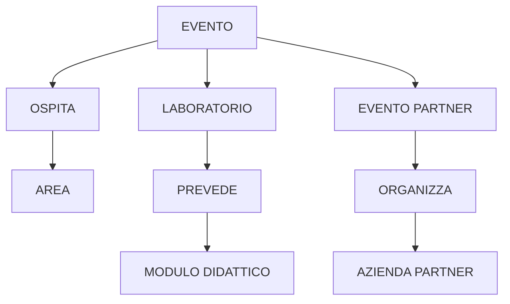
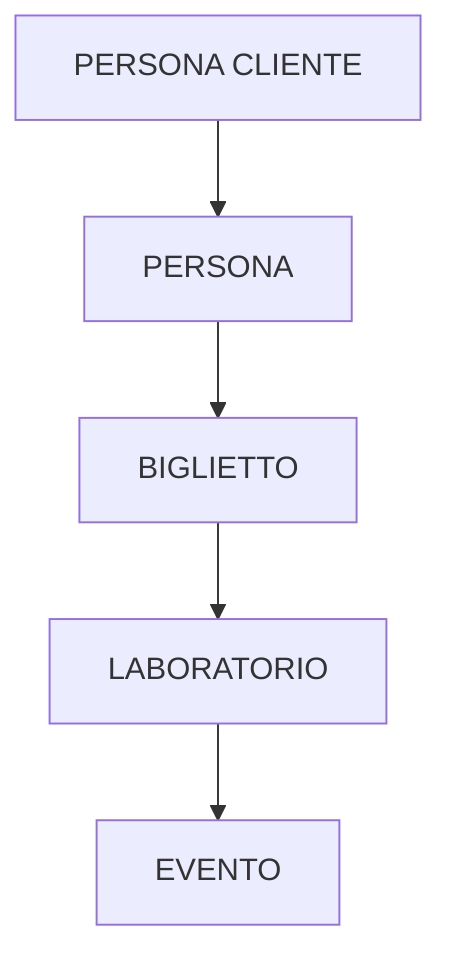
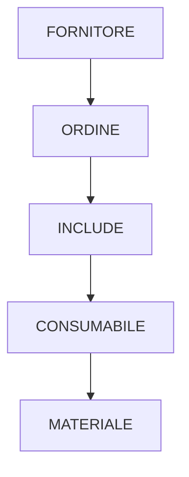

# 3. Progettazione logica

## 3.1 Stima del volume dei dati

Le stime adottano un orizzonte di progetto di **cinque anni** e descrivono un'attività media di due eventi al mese, pari a 24 eventi annui. Si assume che il 75% degli eventi sia costituito da Laboratori FlowForest e il restante 25% da Eventi Partner. Poiché il sistema gestisce i biglietti soltanto per i Laboratori, il volume dei biglietti viene calcolato su 18 Laboratori annui, con una media di 40 partecipanti:

`18 Laboratori/anno x 40 biglietti = 720 biglietti/anno`

Per le anagrafiche e i cataloghi relativamente stabili viene indicato il volume previsto a regime; per eventi, biglietti, feedback, ordini e associazioni storiche viene riportato il volume cumulativo al quinto anno.

| Concetto | Costrutto | Volume a 5 anni | Nuove istanze annue | Ipotesi di calcolo |
| :--- | :---: | ---: | ---: | :--- |
| PERSONA | E | 1.000 | 200 | Anagrafica complessiva a regime |
| CLIENTE_FLOWFOREST | E | 800 | 160 | 780 clienti privati e 20 partner |
| PERSONA_CLIENTE | E | 780 | 156 | Sottotipo privato di CLIENTE_FLOWFOREST |
| AZIENDA_PARTNER | E | 20 | 4 | Sottotipo aziendale di CLIENTE_FLOWFOREST |
| AZIENDA_CLIENTE | E | 30 | 6 | Aziende intestatarie di fatture |
| RISORSA_UMANA | E | 18 | 2 | Organico medio di 15-20 persone |
| FORMATORE | E | 10 | 1 | Ruolo sovrapponibile |
| OPERAIO | E | 7 | 1 | Ruolo sovrapponibile |
| AMMINISTRATIVO | E | 4 | 1 | Ruolo sovrapponibile |
| AREA | E | 6 | trascurabile | Catalogo stabile |
| STRUTTURA | E | 18 | 2 | In media tre strutture per area |
| MATERIALE | E | 200 | 20 | Catalogo a regime |
| ATTREZZATURA | E | 120 | 12 | Circa il 60% dei materiali |
| CONSUMABILE | E | 80 | 8 | Circa il 40% dei materiali |
| FORNITORE | E | 10 | 2 | Anagrafica fornitori |
| ORDINE | E | 50 | 10 | Circa un ordine ogni cinque settimane |
| INCLUDE | R | 400 | 80 | Otto consumabili per ordine |
| MODULO_DIDATTICO | E | 20 | 4 | Catalogo didattico |
| EVENTO | E | 120 | 24 | Due eventi al mese |
| LABORATORIO | E | 90 | 18 | 75% degli eventi |
| EVENTO_PARTNER | E | 30 | 6 | 25% degli eventi |
| OSPITA | R | 180 | 36 | In media 1,5 aree per evento |
| PREVEDE | R | 180 | 36 | In media due moduli per Laboratorio |
| IMPIEGA | R | 420 | 84 | In media 3,5 materiali per evento |
| BIGLIETTO | E | 3.600 | 720 | 40 partecipanti per Laboratorio |
| FEEDBACK | E | 1.800 | 360 | Compilazione da parte del 50% dei partecipanti |

La somma delle istanze di `FORMATORE`, `OPERAIO` e `AMMINISTRATIVO` può superare il numero delle Risorse Umane, poiché la specializzazione è sovrapposta. Analogamente, il numero dei Biglietti è calcolato soltanto sui Laboratori: i partecipanti agli Eventi Partner non rientrano nel perimetro del sistema.

## 3.2 Operazioni principali e stima della frequenza

Le operazioni derivano dai requisiti descritti nella sezione 1.4. Le operazioni interattive (`I`) sono richieste direttamente da un utente; quelle batch o analitiche (`B`) elaborano insiemi di dati più ampi.

| Codice | Operazione | Frequenza stimata | Tipo |
| :--- | :--- | :---: | :---: |
| OP.P1 | Inserire un feedback relativo a un proprio biglietto | 2 al giorno | I |
| OP.P2 | Ricercare un biglietto e il relativo Laboratorio | 20 al giorno | I |
| OP.P3 | Visualizzare i Laboratori futuri | 10 al giorno | I |
| OP.P4 | Visualizzare materiali e quantità richieste dal Laboratorio acquistato | 5 al giorno | I |
| OP.P5 | Verificare l'idoneità all'invito gratuito | 2 al giorno | I |
| OP.G1 | Registrare un cliente, un partner, un'azienda cliente o una risorsa umana | 4 alla settimana | I |
| OP.G2 | Registrare un ordine con le relative righe | 10 all'anno | I |
| OP.G3 | Inserire, aggiornare o eliminare un materiale | 4 al mese | I |
| OP.G4 | Programmare un Laboratorio o un Evento Partner | 2 al mese | I |
| OP.G5 | Modificare dati e moduli di un Laboratorio | 4 al mese | I |
| OP.G6 | Consultare lo storico degli eventi | 4 al mese | I |
| OP.G7 | Calcolare la spesa media annua dei clienti privati | 2 all'anno | B |
| OP.G8 | Ordinare i partner per numero di eventi organizzati | 2 all'anno | B |
| OP.G9 | Calcolare il fatturato dei Laboratori | 2 all'anno | B |
| OP.G10 | Consultare quantità ordinate e disponibilità dei consumabili | 4 alla settimana | I |

L'operazione OP.P5 calcola soltanto il possesso del requisito delle tre partecipazioni concluse. L'emissione e il ciclo di vita di un invito non sono gestiti dal prototipo.

## 3.3 Schemi di navigazione e tavole degli accessi

Gli schemi di navigazione indicano i concetti attraversati da ogni operazione. Le frecce rappresentano il percorso logico sul modello E-R e non il piano fisico di esecuzione scelto dal DBMS.

| Operazione | Schema di navigazione |
| :--- | :--- |
| OP.P1 | `PERSONA -> BIGLIETTO -> GENERA -> FEEDBACK` |
| OP.P2 | `PERSONA -> BIGLIETTO -> VALIDITÀ -> LABORATORIO -> EVENTO` |
| OP.P3 | `EVENTO -> LABORATORIO` |
| OP.P4 | `PERSONA -> BIGLIETTO -> LABORATORIO -> EVENTO -> IMPIEGA -> MATERIALE` |
| OP.P5 | `PERSONA_CLIENTE -> PERSONA -> BIGLIETTO -> LABORATORIO -> EVENTO` |
| OP.G1 | `PERSONA -> PERSONA_CLIENTE -> CLIENTE_FLOWFOREST`, oppure `CLIENTE_FLOWFOREST -> AZIENDA_PARTNER`, oppure inserimento autonomo di `AZIENDA_CLIENTE` o `RISORSA_UMANA` |
| OP.G2 | `FORNITORE -> ORDINE -> INCLUDE -> CONSUMABILE -> MATERIALE` |
| OP.G3 | `MATERIALE -> {ATTREZZATURA, CONSUMABILE}` |
| OP.G4 | `EVENTO -> OSPITA -> AREA`; per un Laboratorio: `EVENTO -> LABORATORIO -> PREVEDE -> MODULO_DIDATTICO`; per un Evento Partner: `EVENTO -> EVENTO_PARTNER -> ORGANIZZA -> AZIENDA_PARTNER` |
| OP.G5 | `EVENTO -> LABORATORIO -> PREVEDE -> MODULO_DIDATTICO` |
| OP.G6 | `EVENTO -> {LABORATORIO, EVENTO_PARTNER}` |
| OP.G7 | `PERSONA_CLIENTE -> PERSONA -> BIGLIETTO -> LABORATORIO -> EVENTO` |
| OP.G8 | `AZIENDA_PARTNER -> ORGANIZZA -> EVENTO_PARTNER -> EVENTO` |
| OP.G9 | `EVENTO -> LABORATORIO -> BIGLIETTO` |
| OP.G10 | `FORNITORE -> ORDINE -> INCLUDE -> CONSUMABILE -> MATERIALE` |

I percorsi meno lineari possono essere sintetizzati nei seguenti schemi.

*Figura 3.1 - Schema di navigazione di OP.G4.*

*Figura 3.2 - Percorso comune alle operazioni OP.P5 e OP.G7.*

*Figura 3.3 - Percorso comune alle operazioni OP.G2 e OP.G10.*

Per stimare il carico logico viene attribuito peso 1 a ogni lettura (`L`) e peso 2 a ogni scrittura (`S`):

`costo per esecuzione = L + 2 x S`

Per rendere confrontabili frequenze differenti, il carico viene annualizzato usando 365 giorni, 52 settimane e 12 mesi. Si assumono mediamente sei Laboratori futuri mostrati, cinque materiali per evento, cinque partecipazioni storiche per il controllo OP.P5, otto righe per ordine, due aree per evento in fase di inserimento e due moduli per Laboratorio. Gli identificatori immessi dall'utente e il profilo autenticato si considerano già disponibili.

### 3.3.1 Tavole degli accessi delle operazioni dei partecipanti

| Operazione | Concetto | Costrutto | Accessi | Tipo |
| :--- | :--- | :---: | ---: | :---: |
| OP.P1 | BIGLIETTO | E | 1 | L |
| OP.P1 | FEEDBACK | E | 1 | S |
| OP.P2 | BIGLIETTO | E | 1 | L |
| OP.P2 | LABORATORIO | E | 1 | L |
| OP.P2 | EVENTO | E | 1 | L |
| OP.P3 | EVENTO | E | 6 | L |
| OP.P3 | LABORATORIO | E | 6 | L |
| OP.P4 | BIGLIETTO | E | 1 | L |
| OP.P4 | LABORATORIO | E | 1 | L |
| OP.P4 | EVENTO | E | 1 | L |
| OP.P4 | IMPIEGA | R | 5 | L |
| OP.P4 | MATERIALE | E | 5 | L |
| OP.P5 | PERSONA_CLIENTE | E | 1 | L |
| OP.P5 | PERSONA | E | 1 | L |
| OP.P5 | BIGLIETTO | E | 5 | L |
| OP.P5 | LABORATORIO | E | 5 | L |
| OP.P5 | EVENTO | E | 5 | L |

| Operazione | Costo per esecuzione | Esecuzioni annue | Carico annuo |
| :--- | :---: | ---: | ---: |
| OP.P1 | `1L + 1S = 3` | 730 | 2.190 |
| OP.P2 | `3L = 3` | 7.300 | 21.900 |
| OP.P3 | `12L = 12` | 3.650 | 43.800 |
| OP.P4 | `13L = 13` | 1.825 | 23.725 |
| OP.P5 | `17L = 17` | 730 | 12.410 |

### 3.3.2 Tavole degli accessi delle operazioni dei gestori

| Operazione | Concetto | Costrutto | Accessi | Tipo |
| :--- | :--- | :---: | ---: | :---: |
| OP.G1 | PERSONA, quando necessaria | E | 1 | S |
| OP.G1 | CLIENTE_FLOWFOREST, AZIENDA_CLIENTE o RISORSA_UMANA | E | 1 | S |
| OP.G1 | PERSONA_CLIENTE, AZIENDA_PARTNER o sottotipo del personale | E | 1 | S |
| OP.G2 | FORNITORE | E | 1 | L |
| OP.G2 | CONSUMABILE | E | 8 | L |
| OP.G2 | ORDINE | E | 1 | S |
| OP.G2 | INCLUDE | R | 8 | S |
| OP.G3 | MATERIALE | E | 1 | S |
| OP.G3 | ATTREZZATURA oppure CONSUMABILE | E | 1 | S |
| OP.G4 | AREA | E | 2 | L |
| OP.G4 | MODULO_DIDATTICO | E | 2 | L |
| OP.G4 | EVENTO | E | 1 | S |
| OP.G4 | LABORATORIO | E | 1 | S |
| OP.G4 | OSPITA | R | 2 | S |
| OP.G4 | PREVEDE | R | 2 | S |
| OP.G5 | EVENTO | E | 1 | L |
| OP.G5 | LABORATORIO | E | 1 | L |
| OP.G5 | PREVEDE | R | 2 | L |
| OP.G5 | LABORATORIO | E | 1 | S |
| OP.G5 | PREVEDE | R | 2 | S |
| OP.G6 | EVENTO | E | 24 | L |
| OP.G6 | LABORATORIO | E | 18 | L |
| OP.G6 | EVENTO_PARTNER | E | 6 | L |
| OP.G7 | PERSONA_CLIENTE | E | 780 | L |
| OP.G7 | PERSONA | E | 780 | L |
| OP.G7 | BIGLIETTO | E | 720 | L |
| OP.G8 | AZIENDA_PARTNER | E | 20 | L |
| OP.G8 | EVENTO_PARTNER | E | 6 | L |
| OP.G8 | EVENTO | E | 6 | L |
| OP.G9 | EVENTO | E | 18 | L |
| OP.G9 | LABORATORIO | E | 18 | L |
| OP.G9 | BIGLIETTO | E | 720 | L |
| OP.G10 | ORDINE | E | 1 | L |
| OP.G10 | FORNITORE | E | 1 | L |
| OP.G10 | INCLUDE | R | 8 | L |
| OP.G10 | CONSUMABILE | E | 8 | L |
| OP.G10 | MATERIALE | E | 8 | L |

Per OP.G1 il costo riportato rappresenta il caso più completo, nel quale vengono inserite tre tuple collegate. L'inserimento di un'`AZIENDA_CLIENTE`, che non appartiene alla gerarchia `CLIENTE_FLOWFOREST`, richiede invece una sola scrittura.

Per OP.G4 è rappresentato il caso più frequente, cioè l'inserimento di un Laboratorio con due Aree e due Moduli. L'inserimento di un Evento Partner sostituisce gli accessi a `MODULO_DIDATTICO`, `LABORATORIO` e `PREVEDE` con un accesso in lettura ad `AZIENDA_PARTNER` e uno in scrittura a `EVENTO_PARTNER`.

| Operazione | Costo per esecuzione | Esecuzioni annue | Carico annuo |
| :--- | :---: | ---: | ---: |
| OP.G1 | `3S = 6` | 208 | 1.248 |
| OP.G2 | `9L + 9S = 27` | 10 | 270 |
| OP.G3 | `2S = 4` | 48 | 192 |
| OP.G4 | `4L + 6S = 16` | 24 | 384 |
| OP.G5 | `4L + 3S = 10` | 48 | 480 |
| OP.G6 | `48L = 48` | 48 | 2.304 |
| OP.G7 | `2.280L = 2.280` | 2 | 4.560 |
| OP.G8 | `32L = 32` | 2 | 64 |
| OP.G9 | `756L = 756` | 2 | 1.512 |
| OP.G10 | `26L = 26` | 208 | 5.408 |

Le operazioni OP.G7-OP.G9 hanno un costo elevato per singola esecuzione ma una frequenza molto bassa. Questa circostanza è decisiva nell'analisi delle ridondanze: evitare un'aggregazione eseguita due volte all'anno non giustifica necessariamente gli aggiornamenti aggiuntivi richiesti per mantenere coerenti dati derivati.

## 3.4 Analisi delle ridondanze

Per ogni ridondanza candidata si confronta il costo annuale della soluzione senza ridondanza con quello della soluzione che memorizza il dato derivato. Gli accessi comuni alle due soluzioni vengono omessi, perché non modificano il confronto.

### 3.4.1 Numero di biglietti e fatturato memorizzati in LABORATORIO

Gli attributi `numero_biglietti_venduti` e `fatturato` sarebbero derivabili rispettivamente mediante `COUNT` e `SUM(prezzo_pagato)` sui Biglietti validi per il Laboratorio.

**Senza ridondanza**

OP.G9 legge le 18 edizioni annuali dei Laboratori, i relativi record `EVENTO` e circa 720 Biglietti:

`(18 EVENTO + 18 LABORATORIO + 720 BIGLIETTO) x 2 esecuzioni = 756 x 2 = 1.512`

**Con ridondanza**

Il report leggerebbe soltanto `EVENTO` e `LABORATORIO`, ma il riepilogo dovrebbe essere aggiornato a ogni emissione o modifica di un Biglietto:

`(36L x 2 esecuzioni) + (720S x peso 2) = 72 + 1.440 = 1.512`

Il costo minimo è già equivalente. Correzioni del prezzo, annullamenti e cancellazioni richiederebbero ulteriori scritture e aumenterebbero il rischio di discordanza. Poiché `COUNT` e `SUM` possono essere calcolati nella stessa scansione, si sceglie **di non introdurre la ridondanza**.

### 3.4.2 Indicatore di fatturazione aziendale del biglietto

Un attributo booleano `biglietto_aziendale` sarebbe interamente determinato dalla presenza di `p_iva_azienda` nel Biglietto.

| Soluzione | Letture aggiuntive | Scritture aggiuntive | Rischio |
| :--- | ---: | ---: | :--- |
| Verifica `p_iva_azienda IS NOT NULL` | 0 | 0 | Nessuno |
| Memorizzazione di `biglietto_aziendale` | 0 | 1 per inserimento o modifica | Discordanza tra booleano e partita IVA |

Il controllo avviene sulla stessa tupla già letta. L'attributo booleano viene quindi **eliminato**.

### 3.4.3 Indicatore di materiale sotto scorta

L'attributo `sotto_scorta` sarebbe derivabile mediante:

`quantita_inventario <= soglia_minima_riordino`

La schermata di gestione legge comunque tutti i 200 Materiali, in media quattro volte al mese.

**Senza ridondanza**

`200L x 4 consultazioni/mese x 12 mesi = 9.600`

**Con ridondanza**

La lettura resterebbe invariata. Si stimano inoltre 80 variazioni annue connesse alle righe d'ordine e 48 aggiornamenti manuali dell'inventario, per complessivi 128 aggiornamenti:

`9.600L + (128S x peso 2) = 9.856`

La ridondanza non riduce le letture e introduce ulteriori scritture. Anche `sotto_scorta` non viene memorizzato.

### 3.4.4 Decisione finale

| Ridondanza candidata | Costo annuo senza ridondanza | Costo annuo con ridondanza | Decisione |
| :--- | ---: | ---: | :--- |
| Numero biglietti e fatturato del Laboratorio | 1.512 | almeno 1.512 | Non introdotta |
| Booleano biglietto aziendale | nessun accesso aggiuntivo | una scrittura per variazione | Eliminato |
| Booleano materiale sotto scorta | 9.600 | 9.856 | Non introdotta |

I volumi e le frequenze mostrano che i dati di base vengono aggiornati più spesso di quanto vengano richiesti i report aggregati. Lo schema conserva quindi i fatti elementari e calcola i valori derivati con `COUNT`, `SUM` e confronti SQL, evitando anomalie di aggiornamento.

## 3.5 Raffinamento dello schema

### 3.5.1 Attributi, identificatori e chiavi

- Gli attributi del modello concettuale sono atomici; non sono presenti attributi composti da scomporre.
- Per `EVENTO`, `CLIENTE_FLOWFOREST`, `RISORSA_UMANA`, `MODULO_DIDATTICO` e `FEEDBACK` vengono mantenuti identificatori surrogati numerici.
- Restano chiavi naturali il codice fiscale della Persona, la partita IVA delle aziende e dei Fornitori, il codice seriale del Biglietto e il codice articolo del Materiale.
- Gli identificatori esterni e le associazioni uno-a-molti vengono eliminati importando la chiave dell'entità referenziata.
- Le associazioni molti-a-molti diventano relazioni autonome con chiave primaria composta.
- `PERSONA.mail`, `AZIENDA_CLIENTE.pec_fatturazione`, `AZIENDA_CLIENTE.email`, `MATERIALE.nome_materiale`, `MODULO_DIDATTICO.nome` e `LABORATORIO.codice_lab` vengono mantenuti come chiavi alternative mediante vincoli `UNIQUE`.
- La password è un attributo tecnico di `PERSONA`, introdotto nello schema logico per l'autenticazione. In un sistema reale deve contenere esclusivamente un hash sicuro.
- Non viene mantenuto un attributo `ruolo` in `RISORSA_UMANA`: i ruoli ricoperti sono determinati dalla presenza della risorsa nelle relazioni `FORMATORE`, `OPERAIO` e `AMMINISTRATIVO`.

### 3.5.2 Eliminazione delle gerarchie

| Gerarchia | Proprietà | Trasformazione scelta | Motivazione |
| :--- | :--- | :--- | :--- |
| RISORSA_UMANA -> FORMATORE, OPERAIO, AMMINISTRATIVO | Totale e sovrapposta | Padre e figlie distinti con PK condivisa | Una risorsa può ricoprire più ruoli; mansione e livello salariale rimangono una sola volta nel padre. |
| CLIENTE_FLOWFOREST -> PERSONA_CLIENTE, AZIENDA_PARTNER | Totale ed esclusiva | Padre e figlie distinti con PK condivisa | I dati comuni di registrazione restano nel padre e quelli specifici nei sottotipi. |
| MATERIALE -> ATTREZZATURA, CONSUMABILE | Totale ed esclusiva | Padre e figlie distinti con PK condivisa | Evita attributi nulli e mantiene nel padre i dati comuni di inventario. |
| EVENTO -> LABORATORIO, EVENTO_PARTNER | Totale ed esclusiva | Padre e figlie distinti con PK condivisa | Date e partecipanti massimi rimangono comuni; costo del biglietto e dati didattici appartengono soltanto al Laboratorio. |

La strategia adottata corrisponde alla traduzione **una relazione per la superclasse e una per ciascuna sottoclasse** (class table inheritance). Non viene effettuato un collasso completo verso l'alto o verso il basso.

`PERSONA` non appartiene a una gerarchia con `PERSONA_CLIENTE` e `RISORSA_UMANA`: le associazioni uno-a-uno `CORRISPONDE` e `IDENTIFICA` vengono tradotte mediante chiavi esterne univoche.

## 3.6 Traduzione sistematica di entità e associazioni in relazioni

### 3.6.1 Traduzione delle entità

Ogni entità forte genera una relazione contenente i propri attributi semplici. Le entità figlie importano come chiave primaria la chiave della superclasse.

| Entità concettuale | Relazione ottenuta | Chiave primaria |
| :--- | :--- | :--- |
| PERSONA | PERSONA | codice_fiscale |
| CLIENTE_FLOWFOREST | CLIENTE_FLOWFOREST | id_cliente |
| PERSONA_CLIENTE | PERSONA_CLIENTE | id_cliente, importato dal padre |
| AZIENDA_PARTNER | AZIENDA_PARTNER | id_cliente, importato dal padre |
| AZIENDA_CLIENTE | AZIENDA_CLIENTE | p_iva |
| RISORSA_UMANA | RISORSA_UMANA | id_dipendente |
| FORMATORE | FORMATORE | id_dipendente, importato dal padre |
| OPERAIO | OPERAIO | id_dipendente, importato dal padre |
| AMMINISTRATIVO | AMMINISTRATIVO | id_dipendente, importato dal padre |
| AREA | AREA | nome |
| STRUTTURA | STRUTTURA | codice_struttura |
| MATERIALE | MATERIALE | codice_articolo |
| ATTREZZATURA | ATTREZZATURA | codice_articolo, importato dal padre |
| CONSUMABILE | CONSUMABILE | codice_articolo, importato dal padre |
| FORNITORE | FORNITORE | p_iva |
| ORDINE | ORDINE | n_ordine |
| MODULO_DIDATTICO | MODULO_DIDATTICO | id_modulo |
| EVENTO | EVENTO | id_evento |
| LABORATORIO | LABORATORIO | id_evento, importato dal padre |
| EVENTO_PARTNER | EVENTO_PARTNER | id_evento, importato dal padre |
| BIGLIETTO | BIGLIETTO_PERSONA | cod_seriale |
| FEEDBACK | FEEDBACK | id_feedback |

### 3.6.2 Traduzione delle associazioni uno-a-molti e uno-a-uno

| Associazione | Cardinalità | Regola applicata | Risultato |
| :--- | :---: | :--- | :--- |
| CONTIENE (Struttura-Area) | N:1 | PK di AREA importata nel lato N | `STRUTTURA.nome_area` FK |
| COMMISSIONA (Ordine-Fornitore) | N:1 | PK di FORNITORE importata in ORDINE | `ORDINE.p_iva_fornitore` FK |
| ORGANIZZA (Evento Partner-Azienda Partner) | N:1 | PK del partner importata in EVENTO_PARTNER | `EVENTO_PARTNER.id_partner` FK |
| VALIDITÀ (Biglietto-Laboratorio) | N:1 | PK di LABORATORIO importata in BIGLIETTO_PERSONA | `BIGLIETTO_PERSONA.id_evento` FK verso `LABORATORIO` |
| INTESTATO (Biglietto-Persona) | N:1 | PK di PERSONA importata in BIGLIETTO_PERSONA | `BIGLIETTO_PERSONA.codice_fiscale` FK |
| FATTURAZIONE (Biglietto-Azienda Cliente) | N:1 opzionale | PK aziendale importata come attributo nullable | `BIGLIETTO_PERSONA.p_iva_azienda` FK nullable |
| GENERA (Feedback-Biglietto) | 1:0..1 | PK del Biglietto importata in FEEDBACK con unicità | `FEEDBACK.cod_seriale` FK e AK |
| CORRISPONDE (Persona Cliente-Persona) | 1:0..1 | PK di PERSONA importata con unicità | `PERSONA_CLIENTE.codice_fiscale` FK e AK |
| IDENTIFICA (Risorsa Umana-Persona) | 1:0..1 | PK di PERSONA importata con unicità | `RISORSA_UMANA.codice_fiscale` FK e AK |

Il riferimento del Biglietto è diretto a `LABORATORIO` e non genericamente a `EVENTO`. In questo modo lo schema logico impedisce l'emissione di biglietti per gli Eventi Partner.

### 3.6.3 Traduzione delle associazioni molti-a-molti

| Associazione | Attributi propri | Relazione ottenuta | Chiave primaria |
| :--- | :--- | :--- | :--- |
| OSPITA (Evento-Area) | — | EVENTO_AREA(id_evento, nome_area) | (id_evento, nome_area) |
| PREVEDE (Laboratorio-Modulo Didattico) | — | LABORATORIO_MODULO(id_evento, id_modulo) | (id_evento, id_modulo) |
| IMPIEGA (Evento-Materiale) | quantita_impiegata | IMPIEGO_MATERIALE(id_evento, codice_articolo, quantita_impiegata) | (id_evento, codice_articolo) |
| INCLUDE (Ordine-Consumabile) | quantita | DETTAGLIO_ORDINE(n_ordine, codice_articolo, quantita) | (n_ordine, codice_articolo) |

Le chiavi delle entità partecipanti diventano chiavi esterne e formano congiuntamente la chiave primaria delle nuove relazioni. `DETTAGLIO_ORDINE.quantita` esprime la quantità richiesta in quello specifico ordine, mentre `MATERIALE.quantita_inventario` rappresenta la disponibilità corrente: i due valori non sono ridondanti.

## 3.7 Schema relazionale finale

*Legenda: la <u>sottolineatura</u> indica la chiave primaria (PK); FK indica una chiave esterna; AK indica una chiave alternativa soggetta a `UNIQUE`.*

**PERSONA**(<u>codice_fiscale</u>, nome, cognome, note_allergia, data_nascita, telefono, mail, password, contatto_emergenza) 
AK: mail

**CLIENTE_FLOWFOREST**(<u>id_cliente</u>, data_registrazione)

**PERSONA_CLIENTE**(<u>id_cliente</u>, codice_fiscale) 
FK: id_cliente REFERENCES CLIENTE_FLOWFOREST 
FK: codice_fiscale REFERENCES PERSONA 
AK: codice_fiscale

**AZIENDA_PARTNER**(<u>id_cliente</u>, p_iva, nome_azienda, specializzazione, email) 
FK: id_cliente REFERENCES CLIENTE_FLOWFOREST 
AK: p_iva

**AZIENDA_CLIENTE**(<u>p_iva</u>, nome_azienda, pec_fatturazione, email) 
AK: pec_fatturazione 
AK: email

**RISORSA_UMANA**(<u>id_dipendente</u>, iban, data_assunzione, mansione, livello_salariale, codice_fiscale) 
FK: codice_fiscale REFERENCES PERSONA 
AK: codice_fiscale

**FORMATORE**(<u>id_dipendente</u>, certificazioni_attive) 
FK: id_dipendente REFERENCES RISORSA_UMANA

**OPERAIO**(<u>id_dipendente</u>) 
FK: id_dipendente REFERENCES RISORSA_UMANA

**AMMINISTRATIVO**(<u>id_dipendente</u>) 
FK: id_dipendente REFERENCES RISORSA_UMANA

**AREA**(<u>nome</u>, capienza, scopo)

**STRUTTURA**(<u>codice_struttura</u>, funzione_uso, nome_area) 
FK: nome_area REFERENCES AREA

**MATERIALE**(<u>codice_articolo</u>, nome_materiale, quantita_inventario, soglia_minima_riordino) 
AK: nome_materiale

**ATTREZZATURA**(<u>codice_articolo</u>, stato_usura, data_ultimo_utilizzo) 
FK: codice_articolo REFERENCES MATERIALE

**CONSUMABILE**(<u>codice_articolo</u>, data_scadenza, allergeni_presenti) 
FK: codice_articolo REFERENCES MATERIALE

**FORNITORE**(<u>p_iva</u>, ragione_sociale)

**ORDINE**(<u>n_ordine</u>, data_ordine, importo_totale, stato_consegna, p_iva_fornitore) 
FK: p_iva_fornitore REFERENCES FORNITORE

**DETTAGLIO_ORDINE**(<u>n_ordine</u>, <u>codice_articolo</u>, quantita) 
FK: n_ordine REFERENCES ORDINE 
FK: codice_articolo REFERENCES CONSUMABILE

**MODULO_DIDATTICO**(<u>id_modulo</u>, nome, testo) 
AK: nome

**EVENTO**(<u>id_evento</u>, data_inizio, data_fine, partecipanti_max)

**EVENTO_AREA**(<u>id_evento</u>, <u>nome_area</u>) 
FK: id_evento REFERENCES EVENTO 
FK: nome_area REFERENCES AREA

**LABORATORIO**(<u>id_evento</u>, codice_lab, titolo, descrizione, protocollo_op, costo_biglietto) 
FK: id_evento REFERENCES EVENTO 
AK: codice_lab

**LABORATORIO_MODULO**(<u>id_evento</u>, <u>id_modulo</u>) 
FK: id_evento REFERENCES LABORATORIO 
FK: id_modulo REFERENCES MODULO_DIDATTICO

**EVENTO_PARTNER**(<u>id_evento</u>, titolo, id_partner) 
FK: id_evento REFERENCES EVENTO 
FK: id_partner REFERENCES AZIENDA_PARTNER(id_cliente)

**IMPIEGO_MATERIALE**(<u>id_evento</u>, <u>codice_articolo</u>, quantita_impiegata) 
FK: id_evento REFERENCES EVENTO 
FK: codice_articolo REFERENCES MATERIALE

**BIGLIETTO_PERSONA**(<u>cod_seriale</u>, data_emissione, richiesta_allergie, prezzo_pagato, id_evento, p_iva_azienda, codice_fiscale) 
FK: id_evento REFERENCES LABORATORIO(id_evento) 
FK: p_iva_azienda REFERENCES AZIENDA_CLIENTE 
FK: codice_fiscale REFERENCES PERSONA

**FEEDBACK**(<u>id_feedback</u>, voto, commento, data_compilazione, cod_seriale) 
FK: cod_seriale REFERENCES BIGLIETTO_PERSONA 
AK: cod_seriale

I vincoli di partecipazione minima - almeno un'Area per Evento, almeno un Modulo per Laboratorio e almeno un Consumabile per Ordine - non sono garantiti dalla sola chiave esterna della relazione associativa. Devono essere verificati al termine delle rispettive transazioni mediante vincoli differibili, trigger oppure controlli applicativi. Analogamente, la totalità e l'esclusività delle gerarchie richiedono controlli inter-relazionali.

*Figura 3.4 - Schema relazionale finale di FlowForest.*
